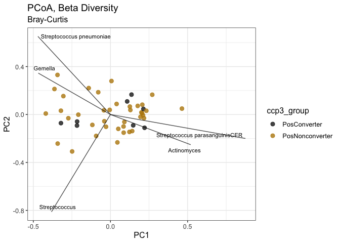

<br>


## Introduction


## The Data  

```r
# Import data
data <- paste(getwd(), "/../data/ALTRA_clinical&16S.merged.19-Dec-2022.analysis_samples.csv", sep="") %>% 
  read_delim(delim = ",") %>%
  mutate(rowname = ifelse(sample_type_16S == "Stool", paste(rowname, "F", sep = ""), rowname)) %>%
  column_to_rownames("rowname")

# OTU table
otu_table <- data %>% select(contains("Bacteria")) %>%
  t() %>% otu_table(taxa_are_rows = T)

# Sample metadata
metadata <- data %>% select(-contains("Bacteria")) %>%
  select(sample_id, ccp3_group, ccp3, everything())

# Taxonomy matrix
otu_names <- otu_table %>% as.data.frame() %>% rownames()
tax_levels <- c("Domain", "Phylum", "Class", "Order", "Family", "Genus", "Species")
otu_tax_split <- sapply(otu_names, FUN=function(x) strsplit(x, "/"))
tax_table <- plyr::ldply(otu_tax_split, rbind)[-1] %>%
  set_rownames(otu_names) %>%
  set_colnames(tax_levels) %>%
  as.matrix()

# Phyloseq object
physeq <- phyloseq(otu_table(otu_table), tax_table(tax_table), sample_data(metadata))
```

### Missing Data  

```r
data %>% select(-contains("Bacteria/")) %>% vis_miss() +
  scale_fill_manual(values = c("gray15", "darkgoldenrod")) +
  theme_bw() +
  theme(axis.text.x = element_text(angle = 30, hjust = 0)) +
  guides(fill = guide_legend(title = "Missing"))
```

<!-- -->
<br>
<br>

### Subject Counts

```r
# Subject counts by grouping - matches up with what is reported by Kevin Deane's team
subject_counts <- data %>% select(sample_id, ccp3_group) %>% 
  unique() %>% select(ccp3_group) %>% table() %>% as.data.frame() %>%
  column_to_rownames(".") %>% dplyr::rename("All Subjects" = "Freq") %>% t()

stool_counts <- data %>% filter(sample_type_16S == "Stool") %>% select(sample_id, ccp3_group) %>% 
  select(ccp3_group) %>% table() %>% as.data.frame() %>%
  column_to_rownames(".") %>% dplyr::rename("Stool" = "Freq") %>% t()

sputum_counts <- data %>% filter(sample_type_16S == "Sputum") %>% select(sample_id, ccp3_group) %>% 
  select(ccp3_group) %>% table() %>% as.data.frame() %>%
  column_to_rownames(".") %>% dplyr::rename("Sputum" = "Freq") %>% t()

rbind(subject_counts, stool_counts, sputum_counts) %>% knitr::kable()
```


|             | NegControl| PosConverter| PosNonconverter| PosRA|
|:------------|----------:|------------:|---------------:|-----:|
|All Subjects |         32|           14|              40|     5|
|Stool        |         32|           14|              40|     5|
|Sputum       |         19|            8|              38|     2|

### Table 1 {.tabset .tabset-pills}
#### Stool

```r
# Table 1 (source: https://cran.r-project.org/web/packages/tableone/vignettes/introduction.html)
vars <- c("age", "gender", "race", "bmi", "ever_smoke")
cat_vars <- c("gender", "race", "ever_smoke")
table1 <- CreateTableOne(
  vars = vars, factorVars = cat_vars, strata = c("ccp3_group"), data = data %>% filter(sample_type_16S == "Stool"))
print(table1, print = F, nonnormal = T, minMax = F, contDigits=0) %>% 
  as.data.frame() %>% 
  select(-test, -p) %>%
  knitr::kable(booktabs = T, align = "ccccc")
```


|                   | NegControl  | PosConverter | PosNonconverter |    PosRA    |
|:------------------|:-----------:|:------------:|:---------------:|:-----------:|
|n                  |     32      |      14      |       40        |      5      |
|age (median [IQR]) | 49 [36, 60] | 56 [46, 65]  |   66 [50, 73]   | 57 [51, 59] |
|gender = Male (%)  |  12 (37.5)  |   2 (14.3)   |    11 (27.5)    |  0 ( 0.0)   |
|race (%)           |             |              |                 |             |
|Asian              |  0 ( 0.0)   |   0 ( 0.0)   |    1 ( 2.5)     |  0 ( 0.0)   |
|Biracial           |  1 ( 3.1)   |   0 ( 0.0)   |    0 ( 0.0)     |  0 ( 0.0)   |
|Biracial, Hispanic |  0 ( 0.0)   |   0 ( 0.0)   |    1 ( 2.5)     |  0 ( 0.0)   |
|Black              |  1 ( 3.1)   |   3 (21.4)   |    3 ( 7.5)     |  0 ( 0.0)   |
|Hispanic           |  2 ( 6.2)   |   4 (28.6)   |    1 ( 2.5)     |  1 (20.0)   |
|NHW                |  27 (84.4)  |   7 (50.0)   |    34 (85.0)    |  4 (80.0)   |
|White, Hispanic    |  1 ( 3.1)   |   0 ( 0.0)   |    0 ( 0.0)     |  0 ( 0.0)   |
|bmi (median [IQR]) | 26 [23, 30] | 28 [24, 33]  |   27 [23, 29]   | 26 [25, 26] |
|ever_smoke = 1 (%) |  7 (23.3)   |   4 (28.6)   |    14 (35.0)    |  2 (40.0)   |

#### Sputum

```r
# Table 1 (source: https://cran.r-project.org/web/packages/tableone/vignettes/introduction.html)
vars <- c("age", "gender", "race", "bmi", "ever_smoke")
cat_vars <- c("gender", "race", "ever_smoke")
table1 <- CreateTableOne(
  vars = vars, factorVars = cat_vars, strata = c("ccp3_group"), data = data %>% filter(sample_type_16S == "Sputum"))
print(table1, print = F, nonnormal = T, minMax = F, contDigits=0) %>% 
  as.data.frame() %>% 
  select(-test, -p) %>%
  knitr::kable(booktabs = T, align = "ccccc")
```


|                   | NegControl  | PosConverter | PosNonconverter |    PosRA    |
|:------------------|:-----------:|:------------:|:---------------:|:-----------:|
|n                  |     19      |      8       |       38        |      2      |
|age (median [IQR]) | 46 [34, 55] | 60 [47, 69]  |   66 [51, 73]   | 67 [63, 71] |
|gender = Male (%)  |  6 (31.6)   |   2 (25.0)   |    11 (28.9)    |  0 (  0.0)  |
|race (%)           |             |              |                 |             |
|Asian              |  0 ( 0.0)   |   0 ( 0.0)   |    1 ( 2.6)     |  0 (  0.0)  |
|Biracial, Hispanic |  0 ( 0.0)   |   0 ( 0.0)   |    1 ( 2.6)     |  0 (  0.0)  |
|Black              |  1 ( 5.3)   |   2 (25.0)   |    3 ( 7.9)     |  0 (  0.0)  |
|Hispanic           |  1 ( 5.3)   |   1 (12.5)   |    1 ( 2.6)     |  0 (  0.0)  |
|NHW                |  16 (84.2)  |   5 (62.5)   |    32 (84.2)    |  2 (100.0)  |
|White, Hispanic    |  1 ( 5.3)   |   0 ( 0.0)   |    0 ( 0.0)     |  0 (  0.0)  |
|bmi (median [IQR]) | 26 [24, 31] | 28 [22, 31]  |   27 [23, 29]   | 32 [29, 35] |
|ever_smoke = 1 (%) |  3 (15.8)   |   2 (25.0)   |    14 (36.8)    |  0 (  0.0)  |

### {-}

<br>
<br>

## EDA
### Alpha Diversity by CCP-Group {.tabset .tabset-pills}
The violin/boxplots below show the distributions of various alpha diversity measurements, stratified by CCP-group and sample type.  
<br>

#### Shannon Diversity

```r
# Shannon diversity plot
metadata %>%
  mutate(group_sampletype = paste(ccp3_group, sample_type_16S, sep = "_")) %>%
  ggplot(aes(x=sample_type_16S, y=ShannonH.Median)) +
  geom_violin(aes(fill = group_sampletype), color = "gray5", lwd = 0.6) +
  facet_grid(cols=vars(ccp3_group)) +
  geom_boxplot(width = 0.1, fill = "white", color = "gray5") +
  geom_line(aes(group = sample_id), alpha = 0.5) +
  ggtitle("Shannon Diversity") +
  labs(x = "", y = "Shannon Diversity") +
  theme_bw() +
  scale_fill_brewer(palette = "Paired") +
  theme(plot.title = element_text(hjust=0.5),
        legend.position = "none")
```

<!-- -->

#### Species Richness

```r
# Species richness
metadata %>%
  mutate(group_sampletype = paste(ccp3_group, sample_type_16S, sep = "_")) %>%
  ggplot(aes(x=sample_type_16S, y=Sobs.Median)) +
  geom_violin(aes(fill = group_sampletype), color = "gray5", lwd = 0.6) +
  facet_grid(cols=vars(ccp3_group)) +
  geom_boxplot(width = 0.1, fill = "white", color = "gray5") +
  geom_line(aes(group = sample_id), alpha = 0.5) +
  ggtitle("Species Richness") +
  labs(x = "", y = "Species Richness") +
  theme_bw() +
  scale_fill_brewer(palette = "Paired") +
  theme(plot.title = element_text(hjust=0.5),
        legend.position = "none")
```

<!-- -->

#### Species Evenness

```r
# Species evenness
metadata %>%
  mutate(group_sampletype = paste(ccp3_group, sample_type_16S, sep = "_")) %>%
  ggplot(aes(x=sample_type_16S, y=ShannonE.Median)) +
  geom_violin(aes(fill = group_sampletype), color = "gray5", lwd = 0.6) +
  facet_grid(cols=vars(ccp3_group)) +
  geom_boxplot(width = 0.1, fill = "white", color = "gray5") +
  geom_line(aes(group = sample_id), alpha = 0.5) +
  ggtitle("Species Evenness") +
  labs(x = "", y = "Species Evenness") +
  theme_bw() +
  scale_fill_brewer(palette = "Paired") +
  theme(plot.title = element_text(hjust=0.5),
        legend.position = "none")
```

<!-- -->

### Community Compositions {.tabset .tabset-pills}
Below are stacked bar charts showing community compositions. Bars are ordered by community similarity, as determined through hierarchical clustering (using Bray-Curtis distance). Squares at the top of each bar represent CCP group (see legend below). The top 15 taxa observed among all samples are included - rarer taxa are grouped into the "Other" group. Taxa that were did meet detection criteria (1e-4% relative abundance in at least 10% of samples) are not included, which is why not all stacked bar charts reach 100%.  
<br>

{#id .class width=20% height=5%}


#### Stool, Species-Level  

```r
sample_type = "Stool"
ccp3_groups = c("NegControl", "PosNonconverter", "PosConverter")

ra.physeq <- physeq %>%
    microbiome::transform("compositional") %>%         # Transform to RA
    subset_samples(sample_type_16S == sample_type) %>% # Pick sample type
    subset_samples(ccp3_group %in% ccp3_groups) %>%    # Choose groups
    core(detection=1e-6, prevalence=0.10)              # Pick the core

composition_barchart(ra.physeq=ra.physeq, marker_size=2)
```

<!-- -->


```r
# Set cluster and pheatmap data
cluster.df <- ra.physeq %>% 
  otu_table(taxa_are_rows = TRUE) %>% t() %>% as.data.frame() %>% 
  set_colnames(abbrev_taxa(ra.physeq))

# Create pheatmap
core.physeq <- ra.physeq %>% core(detection=1/100, prevalence=25/100)
pheatmap.df <- core.physeq %>%
  otu_table() %>% t() %>% as.data.frame() %>%
  set_colnames(abbrev_taxa(core.physeq))

# Pheatmap annotations
annotation <- ra.physeq %>% sample_data() %>% as_tibble() %>% as.data.frame() %>%
  select(ccp3, contains("95_pos")) %>%
  mutate(sp_rf_ig_m_95_pos = ifelse(sp_rf_ig_m_95_pos == 0, "Negative", "Positive"),
         sp_rf_ig_a_95_pos = ifelse(sp_rf_ig_a_95_pos == 0, "Negative", "Positive"),
         sp_ccp_ig_a_95_pos = ifelse(sp_ccp_ig_a_95_pos == 0, "Negative", "Positive"),
         sp_ccp_ig_g_95_pos = ifelse(sp_ccp_ig_g_95_pos == 0, "Negative", "Positive")) %>%
  set_rownames(colnames(t(pheatmap.df)))

annotation_color = list(ccp3 = c(CCPminus = "gray10", CCPplus = "darkgoldenrod"))

# Separately displaying dendrogram
pheatmap(t(pheatmap.df), legend = F, color = viridis(100),
         cluster_cols = cluster.df %>% vegdist(method = "bray") %>% hclust(method = "ward.D2"),
         annotation = annotation, annotation_colors = annotation_color,
         border_color = NA, cluster_rows = F, show_colnames = F)
```

<!-- -->

#### Sputum, Species-Level  

```r
sample_type = "Sputum"
ccp3_groups = c("NegControl", "PosNonconverter", "PosConverter", "PosRA")

ra.physeq <- physeq %>%
    microbiome::transform("compositional") %>%         # Transform to RA
    subset_samples(sample_type_16S == sample_type) %>% # Pick sample type
    subset_samples(ccp3_group %in% ccp3_groups) %>%    # Choose groups
    core(detection=1e-6, prevalence=0.10)           # Pick the core
      
composition_barchart(ra.physeq=ra.physeq, marker_size=2.8)
```

<!-- -->


```r
# Set cluster and pheatmap data
cluster.df <- ra.physeq %>% 
  otu_table(taxa_are_rows = TRUE) %>% t() %>% as.data.frame() %>% 
  set_colnames(abbrev_taxa(ra.physeq))

core.physeq <- ra.physeq %>% core(detection=1/100, prevalence=25/100)
pheatmap.df <- core.physeq %>%
  otu_table() %>% t() %>% as.data.frame() %>%
  set_colnames(abbrev_taxa(core.physeq))

# pheatmap annotations
annotation <- ra.physeq %>% sample_data() %>% as_tibble() %>% as.data.frame() %>%
  select(ccp3, contains("95_pos")) %>%
  mutate(sp_rf_ig_m_95_pos = ifelse(sp_rf_ig_m_95_pos == 0, "Negative", "Positive"),
         sp_rf_ig_a_95_pos = ifelse(sp_rf_ig_a_95_pos == 0, "Negative", "Positive"),
         sp_ccp_ig_a_95_pos = ifelse(sp_ccp_ig_a_95_pos == 0, "Negative", "Positive"),
         sp_ccp_ig_g_95_pos = ifelse(sp_ccp_ig_g_95_pos == 0, "Negative", "Positive")) %>%
  set_rownames(colnames(t(pheatmap.df)))

annotation_color = list(
    ccp3 = c(CCPminus = "gray10", CCPplus = "darkgoldenrod"))

# Separately displaying dendrogram
pheatmap(t(pheatmap.df), legend = F, color = viridis(100),
         cluster_cols = cluster.df %>% vegdist(method = "bray") %>% hclust(method = "ward.D2"),
         annotation = annotation, annotation_colors = annotation_color,
         border_color = NA, cluster_rows = F, show_colnames = F)
```

<!-- -->

### {-}
<br>
<br>

## Inference  

### Hypothesis 1
#### CCP(+) vs CCP(-)  
*There are microbiome differences between groups suggesting relationships between ‘autoimmune states’.*  
<br>
For this section, we will consider CCP(+) individuals as those individuals who are CCP(+) but do not have RA (both CCPPosNonconverters and CCPPosConverters). We will compare this group to the CCP(-) (NegControl) group.  
<br>

#### Stool {.tabset .tabset-pills}

```r
# Pick relative abundances (compositional) and sample metadata
sample_type = "Stool"
pseq <- physeq %>% 
  subset_samples(sample_type_16S == sample_type) %>%
  subset_samples(ccp3_group != "PosRA") #%>%
  #tax_glom(taxrank="Genus") %>%
  
pseq.rel <- pseq %>% 
  microbiome::transform("compositional") #%>%
  #core(detection = 0.01, prevalence = 0.50)
otu <- abundances(pseq.rel) %>% t() %>% as.data.frame()
meta <- meta(pseq.rel) %>% mutate(ccp3 = factor(ccp3, levels = c(0, 1), labels = c("-", "+")))
```

##### Alpha Diversity  

```r
# Shannon diversity plot
shannon <- meta %>%
  ggplot(aes(x=ccp3, y=ShannonH.Median)) +
  geom_violin(aes(fill = ccp3), color = "gray5", lwd = 0.6, width = 0.8) +
  geom_boxplot(width = 0.2, fill = "white", color = "gray5") +
  geom_jitter(aes(color = ccp3), width = 0.03, alpha = 0.8) +
  geom_line(aes(group = sample_id), alpha = 0.5) +
  ggtitle("Shannon Diversity") +
  theme_bw() +
  scale_fill_manual(values = c("gray10", "darkgoldenrod")) +
  scale_color_manual(values = c("gray60", "black")) +
  theme(plot.title = element_text(hjust=0.5),
        legend.position = "none",
        axis.title.x = element_blank(),
        axis.title.y = element_blank())

# Sobs diversity plot
sobs <- meta %>%
  ggplot(aes(x=ccp3, y=Sobs.Median)) +
  geom_violin(aes(fill = ccp3), color = "gray5", lwd = 0.6, width = 0.8) +
  geom_boxplot(width = 0.2, fill = "white", color = "gray5") +
  geom_jitter(aes(color = ccp3), width = 0.03, alpha = 0.8) +
  geom_line(aes(group = sample_id), alpha = 0.5) +
  ggtitle("Species Richness") +
  theme_bw() +
  scale_fill_manual(values = c("gray10", "darkgoldenrod")) +
  scale_color_manual(values = c("gray60", "black")) +
  theme(plot.title = element_text(hjust=0.5),
        legend.position = "none",
        axis.title.x = element_blank(),
        axis.title.y = element_blank())

# Species Evenness plot
evenness <- meta %>%
  ggplot(aes(x=ccp3, y=ShannonE.Median)) +
  geom_violin(aes(fill = ccp3), color = "gray5", lwd = 0.6, width = 0.8) +
  geom_boxplot(width = 0.2, fill = "white", color = "gray5") +
  geom_jitter(aes(color = ccp3), width = 0.03, alpha = 0.8) +
  geom_line(aes(group = sample_id), alpha = 0.5) +
  ggtitle("Species Evenness") +
  theme_bw() +
  scale_fill_manual(values = c("gray10", "darkgoldenrod")) +
  scale_color_manual(values = c("gray60", "black")) +
  theme(plot.title = element_text(hjust=0.5),
        legend.position = "none",
        axis.title.x = element_blank(),
        axis.title.y = element_blank())

# Display three on one plot
ggarrange(shannon, sobs, evenness, ncol = 3, nrow = 1)
```

<!-- -->

```r
# Perform tests
shan.stat.test <- wilcox.exact(ShannonH.Median ~ ccp3, data=meta, paired=F)
rich.stat.test <- wilcox.exact(Sobs.Median ~ ccp3, data=meta, paired=F)
even.stat.test <- wilcox.exact(ShannonE.Median ~ ccp3, data=meta, paired=F)

# Output p-value table
data.frame(
  "Measurement" = c("Shannon Diversity", "Species Richness", "Species Evenness"),
  "p.val" = c(
    paste("p = ", round(shan.stat.test$p.value, 2), sep = ""),
    paste("p = ", round(rich.stat.test$p.value, 2), sep = ""),
    paste("p = ", round(even.stat.test$p.value, 2), sep = ""))) %>% 
  knitr::kable()
```


|Measurement       |p.val    |
|:-----------------|:--------|
|Shannon Diversity |p = 0.98 |
|Species Richness  |p = 0.15 |
|Species Evenness  |p = 0.66 |

##### PCoA

```r
# Need core taxa to save time
pcoa_otu <- pseq %>% 
  microbiome::transform("compositional") %>%
  core(detection = 0.01, prevalence = 0.10)
core_taxa <- abbrev_taxa(pcoa_otu) # Extract shortened taxa names
pcoa_otu <- pcoa_otu %>%
  abundances() %>% 
  t() %>% as.data.frame() %>%
  set_colnames(abbrev_taxa(pcoa_otu))

# Determine coordinates for samples
PCoA <- vegdist(pcoa_otu, method="bray") %>%
  cmdscale() %>%
  as.data.frame() %>%
  select(Dim1=`V1`, Dim2=`V2`)

# Get vectors for taxa
taxa_vectors <- envfit(ord = PCoA, env = pcoa_otu)
taxa_vector_coords <- taxa_vectors$vectors$arrows * sqrt(taxa_vectors$vectors$r)
taxa_vector_p.vals <- taxa_vectors$vectors$pvals
vector_df <- data.frame(p_val = taxa_vector_p.vals) %>%
  bind_cols(taxa_vector_coords) %>%
  rownames_to_column("Taxa") %>%
  filter(p_val <= 0.05) %>%
  arrange(p_val) %>% head(5)

# Add metadata to ordination values
pcoa_plot_df <- PCoA %>% 
  merge(pseq %>% sample_data() %>% as.data.frame(), by = 'row.names') %>%
  mutate(ccp3 = factor(ccp3, levels = c(0, 1), labels = c("-", "+"))) %>%
  column_to_rownames('Row.names')

# Ordination bi-plot
pcoa_plot_df %>%
  ggplot(aes(x = Dim1, y = Dim2, color = ccp3)) +
  geom_point(size = 2.5, alpha = 0.8) +
  geom_segment(data = vector_df,
               aes(x = 0, xend = Dim1, y = 0, yend = Dim2), 
               #arrow = arrow(length = unit(0.2, "cm")), 
               colour = "black", stat = "identity", alpha = 0.7, inherit.aes = FALSE) +
  geom_text_repel(data = vector_df, #vjust = "inward", hjust = "inward",
                  aes(x = Dim1, y = Dim2, label = Taxa), 
                  inherit.aes = FALSE, size=3) +
  theme_bw() +
  scale_color_manual(values = c("gray10", "darkgoldenrod")) +
  ggtitle("PCoA, Beta Diversity", "Bray-Curtis") +
  labs(x = "PC1", y = "PC2") +
  theme(text = element_text(size = 12))
```

<!-- -->

```r
# Ordination bi-plot - color differently
pcoa_plot_df %>%
  ggplot(aes(x = Dim1, y = Dim2, color = ccp3_group)) +
  geom_point(size = 2.5, alpha = 0.8) +
  geom_segment(data = vector_df,
               aes(x = 0, xend = Dim1, y = 0, yend = Dim2), 
               #arrow = arrow(length = unit(0.2, "cm")), 
               colour = "black", stat = "identity", alpha = 0.7, inherit.aes = FALSE) +
  geom_text_repel(data = vector_df, #vjust = "inward", hjust = "inward",
                  aes(x = Dim1, y = Dim2, label = Taxa), 
                  inherit.aes = FALSE, size=3) +
  theme_bw() +
  scale_color_manual(values = c("gray10", "darkgoldenrod1", "darkred")) +
  ggtitle("PCoA, Beta Diversity", "Bray-Curtis") +
  labs(x = "PC1", y = "PC2") +
  theme(text = element_text(size = 12))
```

<!-- -->

##### PERMANOVA

```r
# PERMANOVA test using Bray-Curtis distance
set.seed(007) # Set seed for reproducibility - permutation-based test
permanova <- adonis2(
  otu ~ ccp3 + age + gender + race, data = meta, by="margin", permutations = 999, method = "bray")

permanova %>% as.data.frame() %>% 
  mutate_if(is.numeric, ~round(., 3)) %>% 
  dplyr::rename("p.val" = "Pr(>F)") %>%
  mutate(p.val = ifelse(p.val <= 0.05, paste("**", p.val, "****", sep=""), p.val)) %>% 
  mutate_if(is.numeric, ~round(., 2)) %>%
  knitr::kable(align = 'ccccc')
```


|         | Df | SumOfSqs |  R2  |  F   |    p.val    |
|:--------|:--:|:--------:|:----:|:----:|:-----------:|
|ccp3     | 1  |   0.37   | 0.06 | 4.88 | **0.001**** |
|age      | 1  |   0.08   | 0.01 | 1.04 |    0.375    |
|gender   | 1  |   0.12   | 0.02 | 1.55 |    0.104    |
|race     | 6  |   0.34   | 0.05 | 0.75 |    0.833    |
|Residual | 76 |   5.74   | 0.86 |  NA  |     NA      |
|Total    | 85 |   6.70   | 1.00 |  NA  |     NA      |

**Dispersions Plot**

```r
# Plot dispersion distances for each "group"
beta_dispersion <- otu %>% vegdist(method = "bray") %>% betadisper(meta$ccp3)
plot(beta_dispersion, hull=FALSE, ellipse=TRUE)
```

<!-- -->

**Homogeneity of Dispersons**

```r
# Hypothesis test
set.seed(007)
otu %>% vegdist() %>% betadisper(meta$ccp3) %>% permutest()
```

```
## 
## Permutation test for homogeneity of multivariate dispersions
## Permutation: free
## Number of permutations: 999
## 
## Response: Distances
##           Df  Sum Sq   Mean Sq      F N.Perm Pr(>F)
## Groups     1 0.00083 0.0008345 0.1086    999  0.764
## Residuals 84 0.64537 0.0076830
```

##### Differential Abundance Analysis  
The model reports "ccp3_CCPplus_vs_CCPminus", which should indicate that the **CCPminus group is the reference**. An $\alpha$-level of 0.05 is used as the threshold for selecting taxa.  

```r
# Convert physeq object to deseq and fit model
deseq <- phyloseq_to_deseq2(pseq, ~ ccp3) # Convert physeq object to deseq
fit <- DESeq2::DESeq(deseq, test="Wald", fitType="parametric") # Fit model

# Taxonomy info to get short names
tax_info <- pseq %>% tax_table() %>% as.data.frame() %>%
  mutate(short_name = abbrev_taxa(pseq))

# Extract, filter and sort results
options(digits = 3)
results <- DESeq2::results(fit, cooksCutoff = F, tidy = TRUE) %>%
  filter(padj < 0.05) %>% # Select significant p-vals
  column_to_rownames("row") %>%
  merge(tax_info, by = "row.names") %>%
  arrange(log2FoldChange) # Sort by log2FoldChange

# Plot
order <- results$short_name
results$short_name <- factor(results$short_name, levels = order)

# Plot taxa that fit core criteria and are also differentially abundant
core_taxa <- pseq.rel %>% core_members(detection = 1/100, prevalence = 10/100) # Filter out rare stuff
significant_taxa <- results$Row.names
filtered_sig_taxa <- intersect(core_taxa, significant_taxa) # Taxa both significant and not rare
sig_taxa.df <- pseq.rel %>% 
  otu_table() %>% t() %>% as.data.frame() %>%
  select(filtered_sig_taxa) %>%
  merge(meta %>% select(ccp3), by = "row.names") %>%
  column_to_rownames("Row.names")

sig_taxa.df %>%
  melt(idvars = ccp3) %>%
  dplyr::rename(Row.names = variable, rel_ab = value) %>%
  merge(results %>% select(Row.names, short_name), by = "Row.names") %>%
  group_by(ccp3, short_name) %>%
  dplyr::summarize(Median.RA = median(rel_ab) * 100, IQR = IQR(rel_ab) * 100) %>%
  ungroup() %>%
  dplyr::rename(Taxa = short_name) %>%
  arrange(Taxa, ccp3) %>% knitr::kable()
```


|ccp3 |Taxa                  | Median.RA|    IQR|
|:----|:---------------------|---------:|------:|
|-    |Peptostreptococcaceae |     3.889|  5.686|
|+    |Peptostreptococcaceae |     1.016|  2.908|
|-    |Coriobacteriaceae     |     0.474|  0.784|
|+    |Coriobacteriaceae     |     0.469|  0.475|
|-    |Blautia               |    17.429| 15.685|
|+    |Blautia               |    18.102| 10.125|
|-    |Bacteroidales         |     0.028|  0.115|
|+    |Bacteroidales         |     0.140|  0.830|
|-    |Bacteroides           |     0.245|  0.843|
|+    |Bacteroides           |     2.797|  7.502|

```r
results %>%
  filter(Row.names %in% filtered_sig_taxa) %>%
  ggplot(aes(x = short_name, y = log2FoldChange, fill = Phylum)) +
  geom_bar(stat="identity") +
  coord_flip() +
  scale_fill_manual(values = c("#EBCC2A", "#F21A00", "#3B9AB2")) +
  ggtitle("Changes in Relative Abundance for Significant Taxa", "CCP(+) vs CCP(-)") + 
  theme_bw() +
  theme(axis.title.y = element_blank())
```

<!-- -->


```r
# maaslin2.ccp <- Maaslin2(
#   input_data = otu, 
#   input_metadata = meta, 
#   output = "maaslin2_output.stool.ccpplus_vs_ccpneg", 
#   fixed_effects = c("ccp3"))
```

#### {-} 

<br>

#### Sputum {.tabset .tabset-pills}

```r
# Pick relative abundances (compositional) and sample metadata
sample_type = "Sputum"
pseq <- physeq %>% 
  subset_samples(sample_type_16S == sample_type) %>%
  subset_samples(ccp3_group != "PosRA") #%>%
  #tax_glom(taxrank="Genus") %>%
  
pseq.rel <- pseq %>% 
  microbiome::transform("compositional") #%>%
  #core(detection = 0.01, prevalence = 0.50)

otu <- abundances(pseq.rel) %>% t() %>% as.data.frame()
meta <- meta(pseq.rel) %>% mutate(ccp3 = factor(ccp3, levels = c(0, 1), labels = c("-", "+")))
```

##### Alpha Diversity  

```r
# Shannon diversity plot
shannon <- meta %>%
  ggplot(aes(x=ccp3, y=ShannonH.Median)) +
  geom_violin(aes(fill = ccp3), color = "gray5", lwd = 0.6, width = 0.8) +
  geom_boxplot(width = 0.2, fill = "white", color = "gray5") +
  geom_jitter(aes(color = ccp3), width = 0.03, alpha = 0.8) +
  geom_line(aes(group = sample_id), alpha = 0.5) +
  ggtitle("Shannon Diversity") +
  theme_bw() +
  scale_fill_manual(values = c("gray10", "darkgoldenrod")) +
  scale_color_manual(values = c("gray60", "black")) +
  theme(plot.title = element_text(hjust=0.5),
        legend.position = "none",
        axis.title.x = element_blank(),
        axis.title.y = element_blank())

# Sobs diversity plot
sobs <- meta %>%
  ggplot(aes(x=ccp3, y=Sobs.Median)) +
  geom_violin(aes(fill = ccp3), color = "gray5", lwd = 0.6, width = 0.8) +
  geom_boxplot(width = 0.2, fill = "white", color = "gray5") +
  geom_jitter(aes(color = ccp3), width = 0.03, alpha = 0.8) +
  geom_line(aes(group = sample_id), alpha = 0.5) +
  ggtitle("Species Richness") +
  theme_bw() +
  scale_fill_manual(values = c("gray10", "darkgoldenrod")) +
  scale_color_manual(values = c("gray60", "black")) +
  theme(plot.title = element_text(hjust=0.5),
        legend.position = "none",
        axis.title.x = element_blank(),
        axis.title.y = element_blank())

# Species Evenness plot
evenness <- meta %>%
  ggplot(aes(x=ccp3, y=ShannonE.Median)) +
  geom_violin(aes(fill = ccp3), color = "gray5", lwd = 0.6, width = 0.8) +
  geom_boxplot(width = 0.2, fill = "white", color = "gray5") +
  geom_jitter(aes(color = ccp3), width = 0.03, alpha = 0.8) +
  geom_line(aes(group = sample_id), alpha = 0.5) +
  ggtitle("Species Evenness") +
  theme_bw() +
  scale_fill_manual(values = c("gray10", "darkgoldenrod")) +
  scale_color_manual(values = c("gray60", "black")) +
  theme(plot.title = element_text(hjust=0.5),
        legend.position = "none",
        axis.title.x = element_blank(),
        axis.title.y = element_blank())

# Display three on one plot
ggarrange(shannon, sobs, evenness, ncol = 3, nrow = 1)
```

<!-- -->

```r
# Perform tests
shan.stat.test <- wilcox.exact(ShannonH.Median ~ ccp3, data=meta, paired=F)
rich.stat.test <- wilcox.exact(Sobs.Median ~ ccp3, data=meta, paired=F)
even.stat.test <- wilcox.exact(ShannonE.Median ~ ccp3, data=meta, paired=F)

# Output p-value table
data.frame(
  "Measurement" = c("Shannon Diversity", "Species Richness", "Species Evenness"),
  "p.val" = c(
    paste("p = ", round(shan.stat.test$p.value, 2), sep = ""),
    paste("p = ", round(rich.stat.test$p.value, 2), sep = ""),
    paste("p = ", round(even.stat.test$p.value, 2), sep = ""))) %>% 
  knitr::kable()
```


|Measurement       |p.val    |
|:-----------------|:--------|
|Shannon Diversity |p = 0.05 |
|Species Richness  |p = 0.12 |
|Species Evenness  |p = 0.08 |

##### PCoA

```r
# Need core taxa to save time
pcoa_otu <- pseq %>% 
  microbiome::transform("compositional") %>%
  core(detection = 0.01, prevalence = 0.10)
core_taxa <- abbrev_taxa(pcoa_otu) # Extract shortened taxa names
pcoa_otu <- pcoa_otu %>%
  abundances() %>% 
  t() %>% as.data.frame() %>%
  set_colnames(abbrev_taxa(pcoa_otu))

# Determine coordinates for samples
PCoA <- vegdist(pcoa_otu, method="bray") %>%
  cmdscale() %>%
  as.data.frame() %>%
  select(Dim1=`V1`, Dim2=`V2`)

# Get vectors for taxa
taxa_vectors <- envfit(ord = PCoA, env = pcoa_otu)
taxa_vector_coords <- taxa_vectors$vectors$arrows * sqrt(taxa_vectors$vectors$r)
taxa_vector_p.vals <- taxa_vectors$vectors$pvals
vector_df <- data.frame(p_val = taxa_vector_p.vals) %>%
  bind_cols(taxa_vector_coords) %>%
  rownames_to_column("Taxa") %>%
  filter(p_val <= 0.05) %>%
  arrange(p_val) %>% head(5)

# Add metadata to ordination values
pcoa_plot_df <- PCoA %>% 
  merge(pseq %>% sample_data() %>% as.data.frame(), by = 'row.names') %>%
  mutate(ccp3 = factor(ccp3, levels = c(0, 1), labels = c("-", "+"))) %>%
  column_to_rownames('Row.names')

# Ordination bi-plot
pcoa_plot_df %>%
  ggplot(aes(x = Dim1, y = Dim2, color = ccp3)) +
  geom_point(size = 2.5, alpha = 0.8) +
  geom_segment(data = vector_df,
               aes(x = 0, xend = Dim1, y = 0, yend = Dim2), 
               colour = "black", stat = "identity", alpha = 0.7, inherit.aes = FALSE) +
  geom_text_repel(data = vector_df, aes(x = Dim1, y = Dim2, label = Taxa), inherit.aes = FALSE, size=3) +
  theme_bw() +
  scale_color_manual(values = c("gray10", "darkgoldenrod")) +
  ggtitle("PCoA, Beta Diversity", "Bray-Curtis") +
  labs(x = "PC1", y = "PC2") +
  theme(text = element_text(size = 12))
```

<!-- -->

##### PERMANOVA
**Homogeneity of dispersions assumption not met!** We should therefore not report the p-value here and should opt for another test. Looking at the dispersion plots, nonetheless, shows us that there is not a significance in community composition between groups (even if we were to use another test). 

```r
# PERMANOVA test using Bray-Curtis distance
set.seed(007) # Set seed for reproducibility - permutation-based test
permanova <- adonis2(otu ~ ccp3 + age + gender + race, data = meta, 
                     by="margin", permutations = 999, method = "bray")

permanova %>% as.data.frame() %>% 
  mutate_if(is.numeric, ~round(., 3)) %>% 
  dplyr::rename("p.val" = "Pr(>F)") %>%
  mutate(p.val = ifelse(p.val <= 0.05, paste("**", p.val, "****", sep=""), p.val)) %>% 
  mutate_if(is.numeric, ~round(., 2)) %>%
  knitr::kable(align = 'ccccc')
```


|         | Df | SumOfSqs |  R2  |  F   | p.val |
|:--------|:--:|:--------:|:----:|:----:|:-----:|
|ccp3     | 1  |   0.16   | 0.02 | 1.25 | 0.22  |
|age      | 1  |   0.19   | 0.02 | 1.49 | 0.14  |
|gender   | 1  |   0.20   | 0.02 | 1.54 | 0.11  |
|race     | 5  |   0.62   | 0.07 | 0.97 | 0.53  |
|Residual | 56 |   7.20   | 0.87 |  NA  |  NA   |
|Total    | 64 |   8.24   | 1.00 |  NA  |  NA   |

**Dispersions Plot**

```r
# Plot dispersion distances for each "group"
beta_dispersion <- otu %>% vegdist(method = "bray") %>% betadisper(meta$ccp3)
plot(beta_dispersion, hull=FALSE, ellipse=TRUE)
```

<!-- -->

**Homogeneity of Dispersons**

```r
# Hypothesis test
set.seed(007)
otu %>% vegdist() %>% betadisper(meta$ccp3) %>% permutest()
```

```
## 
## Permutation test for homogeneity of multivariate dispersions
## Permutation: free
## Number of permutations: 999
## 
## Response: Distances
##           Df Sum Sq Mean Sq    F N.Perm Pr(>F)  
## Groups     1  0.043  0.0433 4.18    999  0.047 *
## Residuals 63  0.653  0.0104                     
## ---
## Signif. codes:  0 '***' 0.001 '**' 0.01 '*' 0.05 '.' 0.1 ' ' 1
```

#### {-}  

<br>
<br>

### Hypothesis 2
#### CCP(+) Nonconverters vs Converters
*There are microbiome differences between CCP+ subjects who do and do not go on to develop clinical RA.*  
<br>
For this section, we will compare CCP(+)-Nonconverters and CCP(+)-Converters. We are testing the hypothesis that certain microbiota associated with ‘real’ development of future RA.  

<br>

#### Stool {.tabset .tabset-pills}

```r
# Pick relative abundances (compositional) and sample metadata
sample_type = "Stool"
pseq <- physeq %>% 
  subset_samples(sample_type_16S == sample_type) %>%
  subset_samples(ccp3_group != "PosRA") %>%
  subset_samples(ccp3_group != "NegControl")
pseq.rel <- pseq %>% 
  microbiome::transform("compositional") #%>%
otu <- abundances(pseq.rel) %>% t() %>% as.data.frame()
meta <- meta(pseq.rel) %>% mutate(ccp3 = factor(ccp3, levels = c(0, 1), labels = c("-", "+")))
```

##### Alpha Diversity  

```r
# Shannon diversity plot
shannon <- meta %>%
  ggplot(aes(x=ccp3_group, y=ShannonH.Median)) +
  geom_violin(aes(fill = ccp3_group), color = "gray5", lwd = 0.6, width = 0.8) +
  geom_boxplot(width = 0.2, fill = "white", color = "gray5") +
  geom_jitter(aes(color = ccp3_group), width = 0.03, alpha = 0.8) +
  geom_line(aes(group = sample_id), alpha = 0.5) +
  ggtitle("Shannon Diversity") +
  theme_bw() +
  scale_fill_manual(values = c("gray10", "darkgoldenrod")) +
  scale_color_manual(values = c("gray60", "black")) +
  theme(plot.title = element_text(hjust=0.5),
        legend.position = "none",
        axis.title.x = element_blank(),
        axis.title.y = element_blank())

# Sobs diversity plot
sobs <- meta %>%
  ggplot(aes(x=ccp3_group, y=Sobs.Median)) +
  geom_violin(aes(fill = ccp3_group), color = "gray5", lwd = 0.6, width = 0.8) +
  geom_boxplot(width = 0.2, fill = "white", color = "gray5") +
  geom_jitter(aes(color = ccp3_group), width = 0.03, alpha = 0.8) +
  geom_line(aes(group = sample_id), alpha = 0.5) +
  ggtitle("Species Richness") +
  theme_bw() +
  scale_fill_manual(values = c("gray10", "darkgoldenrod")) +
  scale_color_manual(values = c("gray60", "black")) +
  theme(plot.title = element_text(hjust=0.5),
        legend.position = "none",
        axis.title.x = element_blank(),
        axis.title.y = element_blank())

# Species Evenness plot
evenness <- meta %>%
  ggplot(aes(x=ccp3_group, y=ShannonE.Median)) +
  geom_violin(aes(fill = ccp3_group), color = "gray5", lwd = 0.6, width = 0.8) +
  geom_boxplot(width = 0.2, fill = "white", color = "gray5") +
  geom_jitter(aes(color = ccp3_group), width = 0.03, alpha = 0.8) +
  geom_line(aes(group = sample_id), alpha = 0.5) +
  ggtitle("Species Evenness") +
  theme_bw() +
  scale_fill_manual(values = c("gray10", "darkgoldenrod")) +
  scale_color_manual(values = c("gray60", "black")) +
  theme(plot.title = element_text(hjust=0.5),
        legend.position = "none",
        axis.title.x = element_blank(),
        axis.title.y = element_blank())

# Display three on one plot
ggarrange(shannon, sobs, evenness, ncol = 3, nrow = 1)
```

<!-- -->

```r
# Perform tests
shan.stat.test <- wilcox.exact(ShannonH.Median ~ ccp3_group, data=meta, paired=F)
rich.stat.test <- wilcox.exact(Sobs.Median ~ ccp3_group, data=meta, paired=F)
even.stat.test <- wilcox.exact(ShannonE.Median ~ ccp3_group, data=meta, paired=F)

# Output p-value table
data.frame(
  "Measurement" = c("Shannon Diversity", "Species Richness", "Species Evenness"),
  "p.val" = c(
    paste("p = ", round(shan.stat.test$p.value, 2), sep = ""),
    paste("p = ", round(rich.stat.test$p.value, 2), sep = ""),
    paste("p = ", round(even.stat.test$p.value, 2), sep = "")
  )
) %>% knitr::kable()
```


|Measurement       |p.val    |
|:-----------------|:--------|
|Shannon Diversity |p = 0.55 |
|Species Richness  |p = 0.38 |
|Species Evenness  |p = 0.9  |

##### PCoA

```r
# Need core taxa to save time
pcoa_otu <- pseq %>% 
  microbiome::transform("compositional") %>%
  core(detection = 0.01, prevalence = 0.10)
core_taxa <- abbrev_taxa(pcoa_otu) # Extract shortened taxa names
pcoa_otu <- pcoa_otu %>%
  abundances() %>% 
  t() %>% as.data.frame() %>%
  set_colnames(abbrev_taxa(pcoa_otu))

# Determine coordinates for samples
PCoA <- vegdist(pcoa_otu, method="bray") %>%
  # Morisita requires integer data; morisita-horn can handle abundance
  cmdscale() %>%
  as.data.frame() %>%
  select(Dim1=`V1`, Dim2=`V2`)

# Get vectors for taxa
taxa_vectors <- envfit(ord = PCoA, env = pcoa_otu)
taxa_vector_coords <- taxa_vectors$vectors$arrows * sqrt(taxa_vectors$vectors$r)
taxa_vector_p.vals <- taxa_vectors$vectors$pvals
vector_df <- data.frame(p_val = taxa_vector_p.vals) %>%
  bind_cols(taxa_vector_coords) %>%
  rownames_to_column("Taxa") %>%
  filter(p_val <= 0.05) %>%
  arrange(p_val) %>% head(5)

# Add metadata to ordination values
pcoa_plot_df <- PCoA %>% 
  merge(pseq %>% sample_data() %>% as.data.frame(), by = 'row.names') %>%
  column_to_rownames('Row.names')

# Ordination bi-plot
pcoa_plot_df %>%
  ggplot(aes(x = Dim1, y = Dim2, color = ccp3_group)) +
  geom_point(size = 2.5, alpha = 0.8) +
  geom_segment(data = vector_df,
               aes(x = 0, xend = Dim1, y = 0, yend = Dim2), 
               #arrow = arrow(length = unit(0.2, "cm")), 
               colour = "black", stat = "identity", alpha = 0.7, inherit.aes = FALSE) +
  geom_text_repel(data = vector_df, #vjust = "inward", hjust = "inward",
                  aes(x = Dim1, y = Dim2, label = Taxa), 
                  inherit.aes = FALSE, size=3) +
  #coord_fixed() +
  #xlim(-1, 0.8) +
  #ylim(-0.6, 1) +
  theme_bw() +
  scale_color_manual(values = c("gray10", "darkgoldenrod")) +
  ggtitle("PCoA, Beta Diversity", "Bray-Curtis") +
  labs(x = "PC1", y = "PC2") +
  theme(text = element_text(size = 12))
```

<!-- -->

##### PERMANOVA

```r
# PERMANOVA test using Bray-Curtis distance
set.seed(007) # Set seed for reproducibility - permutation-based test
permanova <- adonis2(otu ~ ccp3_group + age + gender + race, data = meta, 
                     by = "margin", permutations = 999, method = "bray")

permanova %>% as.data.frame() %>% 
  mutate_if(is.numeric, ~round(., 3)) %>% 
  dplyr::rename("p.val" = "Pr(>F)") %>%
  mutate(p.val = ifelse(p.val <= 0.05, paste("**", p.val, "****", sep=""), p.val)) %>% 
  mutate_if(is.numeric, ~round(., 2)) %>%
  knitr::kable(align = 'ccccc')
```


|           | Df | SumOfSqs |  R2  |  F   | p.val |
|:----------|:--:|:--------:|:----:|:----:|:-----:|
|ccp3_group | 1  |   0.05   | 0.01 | 0.63 | 0.76  |
|age        | 1  |   0.10   | 0.02 | 1.24 | 0.25  |
|gender     | 1  |   0.09   | 0.02 | 1.11 | 0.36  |
|race       | 4  |   0.32   | 0.08 | 1.05 | 0.41  |
|Residual   | 46 |   3.54   | 0.86 |  NA  |  NA   |
|Total      | 53 |   4.14   | 1.00 |  NA  |  NA   |

**Dispersions Plot**

```r
# Plot dispersion distances for each "group"
beta_dispersion <- otu %>% vegdist(method = "bray") %>% betadisper(meta$ccp3_group)
plot(beta_dispersion, hull=FALSE, ellipse=TRUE)
```

<!-- -->

**Homogeneity of Dispersons**

```r
# Hypothesis test
set.seed(007)
otu %>% vegdist() %>% betadisper(meta$ccp3_group) %>% permutest()
```

```
## 
## Permutation test for homogeneity of multivariate dispersions
## Permutation: free
## Number of permutations: 999
## 
## Response: Distances
##           Df Sum Sq Mean Sq    F N.Perm Pr(>F)
## Groups     1  0.014 0.01395 1.41    999   0.24
## Residuals 52  0.514 0.00988
```

#### {-}  

<br>

#### Sputum {.tabset .tabset-pills}

```r
# Pick relative abundances (compositional) and sample metadata
sample_type = "Sputum"
pseq <- physeq %>% 
  subset_samples(sample_type_16S == sample_type) %>%
  subset_samples(ccp3_group != "PosRA") %>%
  subset_samples(ccp3_group != "NegControl")
  #tax_glom(taxrank="Genus") %>%

pseq.rel <- pseq %>% 
  #tax_glom(taxrank="Genus") %>%
  microbiome::transform("compositional") #%>%
  #core(detection = 0.01, prevalence = 0.50)
otu <- abundances(pseq.rel) %>% t() %>% as.data.frame()
meta <- meta(pseq.rel) %>% mutate(ccp3 = factor(ccp3, levels = c(0, 1), labels = c("-", "+")))
```

##### Alpha Diversity  

```r
# Shannon diversity plot
shannon <- meta %>%
  ggplot(aes(x=ccp3_group, y=ShannonH.Median)) +
  geom_violin(aes(fill = ccp3_group), color = "gray5", lwd = 0.6, width = 0.8) +
  geom_boxplot(width = 0.2, fill = "white", color = "gray5") +
  geom_jitter(aes(color = ccp3_group), width = 0.03, alpha = 0.8) +
  geom_line(aes(group = sample_id), alpha = 0.5) +
  ggtitle("Shannon Diversity") +
  theme_bw() +
  scale_fill_manual(values = c("gray10", "darkgoldenrod")) +
  scale_color_manual(values = c("gray60", "black")) +
  theme(plot.title = element_text(hjust=0.5),
        legend.position = "none",
        axis.title.x = element_blank(),
        axis.title.y = element_blank())

# Sobs diversity plot
sobs <- meta %>%
  ggplot(aes(x=ccp3_group, y=Sobs.Median)) +
  geom_violin(aes(fill = ccp3_group), color = "gray5", lwd = 0.6, width = 0.8) +
  geom_boxplot(width = 0.2, fill = "white", color = "gray5") +
  geom_jitter(aes(color = ccp3_group), width = 0.03, alpha = 0.8) +
  geom_line(aes(group = sample_id), alpha = 0.5) +
  ggtitle("Species Richness") +
  theme_bw() +
  scale_fill_manual(values = c("gray10", "darkgoldenrod")) +
  scale_color_manual(values = c("gray60", "black")) +
  theme(plot.title = element_text(hjust=0.5),
        legend.position = "none",
        axis.title.x = element_blank(),
        axis.title.y = element_blank())

# Species Evenness plot
evenness <- meta %>%
  ggplot(aes(x=ccp3_group, y=ShannonE.Median)) +
  geom_violin(aes(fill = ccp3_group), color = "gray5", lwd = 0.6, width = 0.8) +
  geom_boxplot(width = 0.2, fill = "white", color = "gray5") +
  geom_jitter(aes(color = ccp3_group), width = 0.03, alpha = 0.8) +
  geom_line(aes(group = sample_id), alpha = 0.5) +
  ggtitle("Species Evenness") +
  theme_bw() +
  scale_fill_manual(values = c("gray10", "darkgoldenrod")) +
  scale_color_manual(values = c("gray60", "black")) +
  theme(plot.title = element_text(hjust=0.5),
        legend.position = "none",
        axis.title.x = element_blank(),
        axis.title.y = element_blank())

# Display three on one plot
ggarrange(shannon, sobs, evenness, ncol = 3, nrow = 1)
```

<!-- -->

```r
# Perform tests
shan.stat.test <- wilcox.exact(ShannonH.Median ~ ccp3_group, data=meta, paired=F)
rich.stat.test <- wilcox.exact(Sobs.Median ~ ccp3_group, data=meta, paired=F)
even.stat.test <- wilcox.exact(ShannonE.Median ~ ccp3_group, data=meta, paired=F)

# Output p-value table
data.frame(
  "Measurement" = c("Shannon Diversity", "Species Richness", "Species Evenness"),
  "p.val" = c(
    paste("p = ", round(shan.stat.test$p.value, 2), sep = ""),
    paste("p = ", round(rich.stat.test$p.value, 2), sep = ""),
    paste("p = ", round(even.stat.test$p.value, 2), sep = "")
  )
) %>% knitr::kable()
```


|Measurement       |p.val    |
|:-----------------|:--------|
|Shannon Diversity |p = 0.49 |
|Species Richness  |p = 0.53 |
|Species Evenness  |p = 0.77 |

##### PCoA

```r
# Need core taxa to save time
pcoa_otu <- pseq %>% 
  microbiome::transform("compositional") %>%
  core(detection = 0.01, prevalence = 0.10)
core_taxa <- abbrev_taxa(pcoa_otu) # Extract shortened taxa names
pcoa_otu <- pcoa_otu %>%
  abundances() %>% 
  t() %>% as.data.frame() %>%
  set_colnames(abbrev_taxa(pcoa_otu))

# Determine coordinates for samples
PCoA <- vegdist(pcoa_otu, method="bray") %>%
  # Morisita requires integer data; morisita-horn can handle abundance
  cmdscale() %>%
  as.data.frame() %>%
  select(Dim1=`V1`, Dim2=`V2`)

# Get vectors for taxa
taxa_vectors <- envfit(ord = PCoA, env = pcoa_otu)
taxa_vector_coords <- taxa_vectors$vectors$arrows * sqrt(taxa_vectors$vectors$r)
taxa_vector_p.vals <- taxa_vectors$vectors$pvals
vector_df <- data.frame(p_val = taxa_vector_p.vals) %>%
  bind_cols(taxa_vector_coords) %>%
  rownames_to_column("Taxa") %>%
  filter(p_val <= 0.05) %>%
  arrange(p_val) %>% head(5)

# Add metadata to ordination values
pcoa_plot_df <- PCoA %>% 
  merge(pseq %>% sample_data() %>% as.data.frame(), by = 'row.names') %>%
  column_to_rownames('Row.names')

# Ordination bi-plot
pcoa_plot_df %>%
  ggplot(aes(x = Dim1, y = Dim2, color = ccp3_group)) +
  geom_point(size = 2.5, alpha = 0.8) +
  geom_segment(data = vector_df,
               aes(x = 0, xend = Dim1, y = 0, yend = Dim2), 
               #arrow = arrow(length = unit(0.2, "cm")), 
               colour = "black", stat = "identity", alpha = 0.7, inherit.aes = FALSE) +
  geom_text_repel(data = vector_df, #vjust = "inward", hjust = "inward",
                  aes(x = Dim1, y = Dim2, label = Taxa), 
                  inherit.aes = FALSE, size=3) +
  #coord_fixed() +
  #xlim(-1, 0.8) +
  #ylim(-0.6, 1) +
  theme_bw() +
  scale_color_manual(values = c("gray10", "darkgoldenrod")) +
  ggtitle("PCoA, Beta Diversity", "Bray-Curtis") +
  labs(x = "PC1", y = "PC2") +
  theme(text = element_text(size = 12))
```

<!-- -->

##### PERMANOVA

```r
# PERMANOVA test using Bray-Curtis distance
set.seed(007) # Set seed for reproducibility - permutation-based test
permanova <- adonis2(otu ~ ccp3_group + age + gender + race, data = meta, 
                     by="margin", permutations = 999, method = "bray")

permanova %>% as.data.frame() %>% 
  mutate_if(is.numeric, ~round(., 3)) %>% 
  dplyr::rename("p.val" = "Pr(>F)") %>%
  mutate(p.val = ifelse(p.val <= 0.05, paste("**", p.val, "****", sep=""), p.val)) %>% 
  mutate_if(is.numeric, ~round(., 2)) %>%
  knitr::kable(align = 'ccccc')
```


|           | Df | SumOfSqs |  R2  |  F   | p.val |
|:----------|:--:|:--------:|:----:|:----:|:-----:|
|ccp3_group | 1  |   0.03   | 0.00 | 0.20 | 1.00  |
|age        | 1  |   0.14   | 0.02 | 0.98 | 0.43  |
|gender     | 1  |   0.17   | 0.03 | 1.18 | 0.27  |
|race       | 4  |   0.54   | 0.09 | 0.94 | 0.55  |
|Residual   | 38 |   5.43   | 0.86 |  NA  |  NA   |
|Total      | 45 |   6.30   | 1.00 |  NA  |  NA   |

**Dispersions Plot**

```r
# Plot dispersion distances for each "group"
beta_dispersion <- otu %>% vegdist(method = "bray") %>% betadisper(meta$ccp3_group)
plot(beta_dispersion, hull=FALSE, ellipse=TRUE)
```

<!-- -->

**Homogeneity of Dispersons**

```r
# Hypothesis test
set.seed(007)
otu %>% vegdist() %>% betadisper(meta$ccp3_group) %>% permutest()
```

```
## 
## Permutation test for homogeneity of multivariate dispersions
## Permutation: free
## Number of permutations: 999
## 
## Response: Distances
##           Df Sum Sq Mean Sq    F N.Perm Pr(>F)
## Groups     1  0.003 0.00253 0.21    999   0.66
## Residuals 44  0.529 0.01203
```

#### {-}
