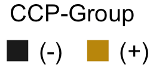

# ALTRA Microbiome Analysis

<br>
```{r setup, include=FALSE}
knitr::opts_chunk$set(message = F, warning = F)
require(tidyverse)
require(readxl)
require(phyloseq)
require(microbiome)
require(ggplot2)
require(vegan)
require(naniar)
require(magrittr)
require(RColorBrewer)
require(knitr)
require(ggdendro)
require(reshape2)
require(varhandle)
require(DESeq2)
require(exactRankTests)
require(ggpubr)
require(ggrepel)
require(RColorBrewer)
require(viridis)
require(pheatmap)
require(Hmisc)
require(Matrix)
require(wesanderson)
require(janitor)
require(stringr)
require(tableone)
require(Maaslin2)
```

```{r, include=FALSE}
# FUNCTIONS
# Operation for 'not in'
`%not in%` <- Negate(`%in%`)

# Get abbreviated taxa names
abbrev_taxa <- function(physeq) {
  short_names <- physeq %>%
    tax_table() %>% as.data.frame() %>%
    rownames_to_column("full_name") %>%
    mutate(lowest_cat = case_when(
      !is.na(Species) ~ Species,
      !is.na(Genus) ~ Genus,
      !is.na(Family) ~ Family,
      !is.na(Order) ~ Order,
      !is.na(Class) ~ Class,
      !is.na(Phylum) ~ Phylum,
      TRUE ~ Domain)) %>%
    select(lowest_cat) %>% pull()
  return(short_names)}

# Violin plot of alpha diversity measurements by CCP grouping
plot_alpha_div <- function(metadata, y, title) {
  plot <- metadata %>%
    mutate(group_sampletype = paste(ccp3_group, sample_type_16S, sep = "_")) %>%
    ggplot(aes_string(x="sample_type_16S", y=y)) +
    geom_violin(aes(fill = group_sampletype), color = "gray5", lwd = 0.6) +
    facet_grid(cols=vars(ccp3_group)) +
    geom_boxplot(width = 0.1, fill = "white", color = "gray5") +
    geom_line(aes(group = sample_id), alpha = 0.5) +
    ggtitle(title) +
    labs(x = "", y = title) +
    theme_bw() +
    scale_fill_brewer(palette = "Paired") +
    theme(plot.title = element_text(hjust=0.5), legend.position = "none")
  return(plot)
}

composition_barchart <- function(ra.physeq, marker_size) {
  
  # physeq --> df
  rel_ab.df <- ra.physeq %>% 
    otu_table(taxa_are_rows = TRUE) %>% t() %>% 
    as.data.frame() %>% 
    set_colnames(abbrev_taxa(ra.physeq))
  
  # Create dendrogram to order samples by similar composition
  dendrogram <- rel_ab.df %>%
    vegdist(method = "bray") %>%
    hclust(method = "ward.D2") %>%
    as.dendrogram() %>%
    dendro_data(type = "rectangle")

  dend_labels <- dendrogram$labels %>%
    as.data.frame() %>%
    mutate(rownames = label) %>%
    column_to_rownames("rownames") %>%
    base::merge(ra.physeq %>% sample_data(), by = 'row.names') %>%
    column_to_rownames("Row.names")

  # Transform data frame to long format and filter for genera with RA > 5%
  dend.rel_ab.df <- ra.physeq %>%
    otu_table(taxa_are_rows = TRUE) %>%          # Select OTU table (RA table now)
    t() %>%                       # Transpose matrix (samples -> col, taxa -> row)
    as.data.frame() %>%
    set_colnames(abbrev_taxa(ra.physeq)) %>% # Replace taxa with short names
    base::merge(ra.physeq %>% sample_data(), by = 'row.names') %>%
    select(-sample_id) %>%
    dplyr::rename(sample_id = Row.names) %>%
    mutate(ccp3 = factor(ccp3, levels = c(0, 1), labels = c("-", "+"))) %>%
    select(sample_id, ccp3, abbrev_taxa(ra.physeq)) %>%
    melt(idvars=c(sample_id, ccp3)) %>% # Make long
    base::merge(dend_labels %>% select(x, label, daysfrom_initial_visit) %>% 
                  dplyr::rename(sample_id = label), by = "sample_id") %>%
    dplyr::rename(taxa = variable, rel_ab = value) %>%
    mutate(rel_ab = rel_ab * 100) %>%                      # Convert to percent
    arrange(x, taxa)                                       # Sort taxa ABC
  
  # Select only top 15 taxa
  top_taxa <- dend.rel_ab.df %>%
    group_by(taxa) %>%
    summarise(sum = sum(rel_ab)) %>%
    arrange(desc(sum)) %>% ungroup() %>%
    head(15) %>% select(taxa) %>% arrange() %>% pull()
  
  # Set palette
  pal <- c("gray80", "#A86825", "#F5C28E", "#F5E49A", "#FFAA01", "#A82B20", 
           "#FC948B", "#2874AD", "#7CC1F5", "#4042A8", "#BBBCFC", "#A63BA8", 
           "#FBB3FC", "#58A828", "#B7F593", "gray25")

  #Stacked bar chart
  dend.rel_ab.df <- dend.rel_ab.df %>%
    mutate_if(is.factor, as.character) %>%
    mutate(taxa = ifelse(taxa %not in% top_taxa, "Other", taxa)) %>%
    group_by(sample_id, taxa, ccp3, daysfrom_initial_visit, x) %>%
    summarise(rel_ab = sum(rel_ab)) %>%
    arrange(x, rel_ab) %>% ungroup()
  
  # Set taxa order
  top_taxa <- dend.rel_ab.df %>% select(taxa) %>% unique() %>% pull()
  taxa_order <- c("Other", sort(top_taxa))
  dend.rel_ab.df$taxa <- factor(dend.rel_ab.df$taxa, levels = taxa_order, labels = taxa_order)
  
  # Plot
  dend.rel_ab.df %>%
    ggplot(aes(x=x, y=rel_ab, fill=taxa)) +
    geom_bar(position="stack", stat="identity") +
    geom_point(aes(x, y=103, color = ccp3), size=marker_size, shape=15) +
    #geom_point(aes(x, y=106, color = daysfrom_initial_visit), size=marker_size, shape=15) +
    scale_fill_manual(values = pal) +
    scale_color_manual(values = c("gray10", "darkgoldenrod")) +
    ylim(-2, 106) +
    labs(x="", y="") +
    guides(fill = guide_legend(ncol = 4),
           color = "none") +
    theme_bw() +
    theme(plot.title=element_text(hjust=0.5),
          plot.subtitle=element_text(hjust=0.5),
          legend.position="bottom",
          legend.text=element_text(size=7),
          legend.margin=ggplot2::margin(t=-25),
          legend.title=element_blank(),
          plot.margin = unit(x = c(0, 0, 0, 0), units = "cm"),
          axis.text = element_blank(),
          axis.ticks = element_blank(),
          panel.grid.major.x = element_blank(),
          panel.grid.minor.x = element_blank(),
          panel.grid.minor.y = element_blank(),
          panel.border = element_blank())}
```

## Introduction


## The Data  
```{r}
# Import data
data <- paste(getwd(), "/../data/ALTRA_clinical&16S.merged.19-Dec-2022.analysis_samples.csv", sep="") %>% 
  read_delim(delim = ",") %>%
  mutate(rowname = ifelse(sample_type_16S == "Stool", paste(rowname, "F", sep = ""), rowname)) %>%
  column_to_rownames("rowname")

# OTU table
otu_table <- data %>% select(contains("Bacteria")) %>%
  t() %>% otu_table(taxa_are_rows = T)

# Sample metadata
metadata <- data %>% select(-contains("Bacteria")) %>%
  select(sample_id, ccp3_group, ccp3, everything())

# Taxonomy matrix
otu_names <- otu_table %>% as.data.frame() %>% rownames()
tax_levels <- c("Domain", "Phylum", "Class", "Order", "Family", "Genus", "Species")
otu_tax_split <- sapply(otu_names, FUN=function(x) strsplit(x, "/"))
tax_table <- plyr::ldply(otu_tax_split, rbind)[-1] %>%
  set_rownames(otu_names) %>%
  set_colnames(tax_levels) %>%
  as.matrix()

# Phyloseq object
physeq <- phyloseq(otu_table(otu_table), tax_table(tax_table), sample_data(metadata))
```

### Missing Data  
```{r, fig.dim=c(8, 4)}
# Visualize missingness
data %>% select(-contains("Bacteria/")) %>% vis_miss() +
  scale_fill_manual(values = c("gray15", "darkgoldenrod")) +
  theme_bw() +
  theme(axis.text.x = element_text(angle = 30, hjust = 0)) +
  guides(fill = guide_legend(title = "Missing"))
```
<br>
<br>

### Subject Counts
```{r, include=FALSE}
# Subject counts by grouping
# All samples
subject_counts <- data %>% select(sample_id, ccp3_group) %>% 
  unique() %>% select(ccp3_group) %>% table() %>% as.data.frame() %>%
  column_to_rownames(".") %>% dplyr::rename("All Subjects" = "Freq") %>% t()

# Stool samples
stool_counts <- data %>% filter(sample_type_16S == "Stool") %>% select(sample_id, ccp3_group) %>% 
  select(ccp3_group) %>% table() %>% as.data.frame() %>%
  column_to_rownames(".") %>% dplyr::rename("Stool" = "Freq") %>% t()

# Sputum samples
sputum_counts <- data %>% filter(sample_type_16S == "Sputum") %>% select(sample_id, ccp3_group) %>% 
  select(ccp3_group) %>% table() %>% as.data.frame() %>%
  column_to_rownames(".") %>% dplyr::rename("Sputum" = "Freq") %>% t()
```

```{r}
# Display subject count table
rbind(subject_counts, stool_counts, sputum_counts) %>% knitr::kable()
```

<br>
<br>

## EDA
### Alpha Diversity by CCP-Group
The violin/boxplots below show the distributions of various alpha diversity measurements, stratified by CCP-group and sample type.  
<br>

#### Shannon Diversity
```{r}
plot_alpha_div(metadata, y="ShannonH.Median", title="Shannon Diversity")
```

#### Species Richness
```{r}
plot_alpha_div(metadata, y="Sobs.Median", title="Species Richness")
```

#### Species Evenness
```{r}
plot_alpha_div(metadata, y="ShannonE.Median", title="Species Evenness")
```

### Community Compositions {.tabset .tabset-pills}
Below are stacked bar charts showing community compositions. Bars are ordered by community similarity, as determined through hierarchical clustering (using Bray-Curtis distance). Squares at the top of each bar represent CCP group (see legend below). The top 15 taxa observed among all samples are included - rarer taxa are grouped into the "Other" group. Taxa that were did meet detection criteria (1e-4% relative abundance in at least 10% of samples) are not included, which is why not all stacked bar charts reach 100%.
<br>

{#id .class width=20% height=5%}

#### Stool, Species-Level  
```{r}
# Filter parameters
sample_type = "Stool"
ccp3_groups = c("NegControl", "PosNonconverter", "PosConverter")

# Filter data set and transform count -> compositional data
ra.physeq <- physeq %>%
    microbiome::transform("compositional") %>%         # Transform to RA
    subset_samples(sample_type_16S == sample_type) %>% # Pick sample type
    subset_samples(ccp3_group %in% ccp3_groups) %>%    # Choose groups
    core(detection=1e-6, prevalence=0.10)              # Pick the core

# Display compositional barchart
composition_barchart(ra.physeq=ra.physeq, marker_size=2)
```

```{r, include=FALSE}
# Set cluster and pheatmap data
cluster.df <- ra.physeq %>% 
  otu_table(taxa_are_rows = TRUE) %>% t() %>% as.data.frame() %>% 
  set_colnames(abbrev_taxa(ra.physeq))

# Create pheatmap
core.physeq <- ra.physeq %>% core(detection=1/100, prevalence=25/100)
pheatmap.df <- core.physeq %>%
  otu_table() %>% t() %>% as.data.frame() %>%
  set_colnames(abbrev_taxa(core.physeq))

# Pheatmap annotations
annotation <- ra.physeq %>% sample_data() %>% as_tibble() %>% as.data.frame() %>%
  select(CCP = ccp3, contains("95_pos")) %>%
  mutate(
    CCP = ifelse(CCP == 0, "-", "+"),
    sp_rf_ig_m_95_pos = ifelse(sp_rf_ig_m_95_pos == 0, "-", "+"),
    sp_rf_ig_a_95_pos = ifelse(sp_rf_ig_a_95_pos == 0, "-", "+"),
    sp_ccp_ig_a_95_pos = ifelse(sp_ccp_ig_a_95_pos == 0, "-", "+"),
    sp_ccp_ig_g_95_pos = ifelse(sp_ccp_ig_g_95_pos == 0, "-", "+")) %>%
  set_rownames(colnames(t(pheatmap.df)))

# Set colors
annotation_color = list(ccp3 = c(CCPminus = "gray10", CCPplus = "darkgoldenrod"))
```

```{r}
# Display pheatmap
pheatmap(
  t(pheatmap.df), legend = F, color = viridis(100),
  cluster_cols = cluster.df %>% vegdist(method = "bray") %>% hclust(method = "ward.D2"),
  annotation = annotation, annotation_colors = annotation_color,
  border_color = NA, cluster_rows = F, show_colnames = F)
```

#### Sputum, Species-Level  
```{r}
# Filter parameters
sample_type = "Sputum"
ccp3_groups = c("NegControl", "PosNonconverter", "PosConverter", "PosRA")

# Filter data set and transform count -> compositional data
ra.physeq <- physeq %>%
    microbiome::transform("compositional") %>%         # Transform to RA
    subset_samples(sample_type_16S == sample_type) %>% # Pick sample type
    subset_samples(ccp3_group %in% ccp3_groups) %>%    # Choose groups
    core(detection=1e-6, prevalence=0.10)              # Pick the core

# Display compositional barchart
composition_barchart(ra.physeq=ra.physeq, marker_size=2.8)
```

```{r, include=FALSE}
# Set cluster and pheatmap data
cluster.df <- ra.physeq %>% 
  otu_table(taxa_are_rows = TRUE) %>% t() %>% as.data.frame() %>% 
  set_colnames(abbrev_taxa(ra.physeq))

# Create pheatmap
core.physeq <- ra.physeq %>% core(detection=1/100, prevalence=25/100)
pheatmap.df <- core.physeq %>%
  otu_table() %>% t() %>% as.data.frame() %>%
  set_colnames(abbrev_taxa(core.physeq))

# # Pheatmap annotations
annotation <- ra.physeq %>% sample_data() %>% as_tibble() %>% as.data.frame() %>%
  select(CCP = ccp3, contains("95_pos")) %>%
  mutate(
    CCP = ifelse(CCP == 0, "-", "+"),
    sp_rf_ig_m_95_pos = ifelse(sp_rf_ig_m_95_pos == 0, "-", "+"),
    sp_rf_ig_a_95_pos = ifelse(sp_rf_ig_a_95_pos == 0, "-", "+"),
    sp_ccp_ig_a_95_pos = ifelse(sp_ccp_ig_a_95_pos == 0, "-", "+"),
    sp_ccp_ig_g_95_pos = ifelse(sp_ccp_ig_g_95_pos == 0, "-", "+")) %>%
  set_rownames(colnames(t(pheatmap.df)))

# Set colors
annotation_color = list(ccp3 = c(CCPminus = "gray10", CCPplus = "darkgoldenrod"))
```

```{r}
# Display pheatmap
pheatmap(
  t(pheatmap.df), legend = F, color = viridis(100),
  cluster_cols = cluster.df %>% vegdist(method = "bray") %>% hclust(method = "ward.D2"),
  annotation = annotation, annotation_colors = annotation_color,
  border_color = NA, cluster_rows = F, show_colnames = F)
```

<br>

## Inference  

### Hypothesis 1: CCP(+) vs CCP(-)  
*There are microbiome differences between CCP(+) and CCP(-) groups suggesting relationships between ‘autoimmune states’.*  
For this section, we will consider CCP(+) individuals as those individuals who are CCP(+) but do not have RA (both CCP(+) converters and non-converters). We will compare this group to the CCP(-) group, or the negative control group.  
<br>

#### Stool {.tabset .tabset-pills}
```{r}
# Pick relative abundances (compositional) and sample metadata
sample_type = "Stool"
pseq <- physeq %>% 
  subset_samples(sample_type_16S == sample_type) %>%
  subset_samples(ccp3_group != "PosRA")
  
pseq.rel <- pseq %>% microbiome::transform("compositional")
otu <- abundances(pseq.rel) %>% t() %>% as.data.frame()
meta <- meta(pseq.rel) %>% mutate(ccp3 = factor(ccp3, levels = c(0, 1), labels = c("-", "+")))
```

##### Alpha Diversity  
```{r, fig.dim=c(8, 3.5)}
# Shannon diversity plot
shannon <- meta %>%
  ggplot(aes(x=ccp3, y=ShannonH.Median)) +
  geom_violin(aes(fill = ccp3), color = "gray5", lwd = 0.6, width = 0.8) +
  geom_boxplot(width = 0.2, fill = "white", color = "gray5") +
  geom_jitter(aes(color = ccp3), width = 0.03, alpha = 0.8) +
  geom_line(aes(group = sample_id), alpha = 0.5) +
  ggtitle("Shannon Diversity") +
  theme_bw() +
  scale_fill_manual(values = c("gray10", "darkgoldenrod")) +
  scale_color_manual(values = c("gray60", "black")) +
  theme(plot.title = element_text(hjust=0.5),
        legend.position = "none",
        axis.title.x = element_blank(),
        axis.title.y = element_blank())

# Sobs diversity plot
sobs <- meta %>%
  ggplot(aes(x=ccp3, y=Sobs.Median)) +
  geom_violin(aes(fill = ccp3), color = "gray5", lwd = 0.6, width = 0.8) +
  geom_boxplot(width = 0.2, fill = "white", color = "gray5") +
  geom_jitter(aes(color = ccp3), width = 0.03, alpha = 0.8) +
  geom_line(aes(group = sample_id), alpha = 0.5) +
  ggtitle("Species Richness") +
  theme_bw() +
  scale_fill_manual(values = c("gray10", "darkgoldenrod")) +
  scale_color_manual(values = c("gray60", "black")) +
  theme(plot.title = element_text(hjust=0.5),
        legend.position = "none",
        axis.title.x = element_blank(),
        axis.title.y = element_blank())

# Species Evenness plot
evenness <- meta %>%
  ggplot(aes(x=ccp3, y=ShannonE.Median)) +
  geom_violin(aes(fill = ccp3), color = "gray5", lwd = 0.6, width = 0.8) +
  geom_boxplot(width = 0.2, fill = "white", color = "gray5") +
  geom_jitter(aes(color = ccp3), width = 0.03, alpha = 0.8) +
  geom_line(aes(group = sample_id), alpha = 0.5) +
  ggtitle("Species Evenness") +
  theme_bw() +
  scale_fill_manual(values = c("gray10", "darkgoldenrod")) +
  scale_color_manual(values = c("gray60", "black")) +
  theme(plot.title = element_text(hjust=0.5),
        legend.position = "none",
        axis.title.x = element_blank(),
        axis.title.y = element_blank())

# Display three on one plot
ggarrange(shannon, sobs, evenness, ncol = 3, nrow = 1)

# Perform tests
shan.stat.test <- wilcox.exact(ShannonH.Median ~ ccp3, data=meta, paired=F)
rich.stat.test <- wilcox.exact(Sobs.Median ~ ccp3, data=meta, paired=F)
even.stat.test <- wilcox.exact(ShannonE.Median ~ ccp3, data=meta, paired=F)

# Output p-value table
data.frame(
  "Measurement" = c("Shannon Diversity", "Species Richness", "Species Evenness"),
  "p.val" = c(
    paste("p = ", round(shan.stat.test$p.value, 2), sep = ""),
    paste("p = ", round(rich.stat.test$p.value, 2), sep = ""),
    paste("p = ", round(even.stat.test$p.value, 2), sep = ""))) %>% 
  knitr::kable()
```

##### PCoA
```{r}
# Need core taxa to save time
pcoa_otu <- pseq %>% 
  microbiome::transform("compositional") %>%
  core(detection = 0.01, prevalence = 0.10)
core_taxa <- abbrev_taxa(pcoa_otu) # Extract shortened taxa names
pcoa_otu <- pcoa_otu %>%
  abundances() %>% 
  t() %>% as.data.frame() %>%
  set_colnames(abbrev_taxa(pcoa_otu))

# Determine coordinates for samples
PCoA <- vegdist(pcoa_otu, method="bray") %>%
  cmdscale() %>%
  as.data.frame() %>%
  select(Dim1=`V1`, Dim2=`V2`)

# Get vectors for taxa
taxa_vectors <- envfit(ord = PCoA, env = pcoa_otu)
taxa_vector_coords <- taxa_vectors$vectors$arrows * sqrt(taxa_vectors$vectors$r)
taxa_vector_p.vals <- taxa_vectors$vectors$pvals
vector_df <- data.frame(p_val = taxa_vector_p.vals) %>%
  bind_cols(taxa_vector_coords) %>%
  rownames_to_column("Taxa") %>%
  filter(p_val <= 0.05) %>%
  arrange(p_val) %>% head(5)

# Add metadata to ordination values
pcoa_plot_df <- PCoA %>% 
  merge(pseq %>% sample_data() %>% as.data.frame(), by = 'row.names') %>%
  mutate(ccp3 = factor(ccp3, levels = c(0, 1), labels = c("-", "+"))) %>%
  column_to_rownames('Row.names')

# Ordination bi-plot
pcoa_plot_df %>%
  ggplot(aes(x = Dim1, y = Dim2, color = ccp3)) +
  geom_point(size = 2.5, alpha = 0.8) +
  geom_segment(data = vector_df,
               aes(x = 0, xend = Dim1, y = 0, yend = Dim2), 
               #arrow = arrow(length = unit(0.2, "cm")), 
               colour = "black", stat = "identity", alpha = 0.7, inherit.aes = FALSE) +
  geom_text_repel(data = vector_df, #vjust = "inward", hjust = "inward",
                  aes(x = Dim1, y = Dim2, label = Taxa), 
                  inherit.aes = FALSE, size=3) +
  theme_bw() +
  scale_color_manual(values = c("gray10", "darkgoldenrod")) +
  ggtitle("PCoA, Beta Diversity", "Bray-Curtis") +
  labs(x = "PC1", y = "PC2") +
  theme(text = element_text(size = 12))

# Ordination bi-plot - color differently
pcoa_plot_df %>%
  ggplot(aes(x = Dim1, y = Dim2, color = ccp3_group)) +
  geom_point(size = 2.5, alpha = 0.8) +
  geom_segment(data = vector_df,
               aes(x = 0, xend = Dim1, y = 0, yend = Dim2), 
               #arrow = arrow(length = unit(0.2, "cm")), 
               colour = "black", stat = "identity", alpha = 0.7, inherit.aes = FALSE) +
  geom_text_repel(data = vector_df, #vjust = "inward", hjust = "inward",
                  aes(x = Dim1, y = Dim2, label = Taxa), 
                  inherit.aes = FALSE, size=3) +
  theme_bw() +
  scale_color_manual(values = c("gray10", "darkgoldenrod1", "darkred")) +
  ggtitle("PCoA, Beta Diversity", "Bray-Curtis") +
  labs(x = "PC1", y = "PC2") +
  theme(text = element_text(size = 12))
```

##### PERMANOVA
```{r}
# PERMANOVA test using Bray-Curtis distance
set.seed(007) # Set seed for reproducibility - permutation-based test
permanova <- adonis2(
  otu ~ ccp3 + age + gender + race, data = meta, by="margin", permutations = 999, method = "bray")

permanova %>% as.data.frame() %>% 
  mutate_if(is.numeric, ~round(., 3)) %>% 
  dplyr::rename("p.val" = "Pr(>F)") %>%
  mutate(p.val = ifelse(p.val <= 0.05, paste("**", p.val, "****", sep=""), p.val)) %>% 
  mutate_if(is.numeric, ~round(., 2)) %>%
  knitr::kable(align = 'ccccc')
```

**Dispersions Plot**
```{r}
# Plot dispersion distances for each "group"
beta_dispersion <- otu %>% vegdist(method = "bray") %>% betadisper(meta$ccp3)
plot(beta_dispersion, hull=FALSE, ellipse=TRUE)
```

**Homogeneity of Dispersons**
```{r}
# Hypothesis test
set.seed(007)
otu %>% vegdist() %>% betadisper(meta$ccp3) %>% permutest()
```

##### Differential Abundance Analysis  
The model reports "ccp3_CCPplus_vs_CCPminus", which should indicate that the **CCPminus group is the reference**. An $\alpha$-level of 0.05 is used as the threshold for selecting taxa.  
```{r}
# Convert physeq object to deseq and fit model
deseq <- phyloseq_to_deseq2(pseq, ~ ccp3) # Convert physeq object to deseq
fit <- DESeq2::DESeq(deseq, test="Wald", fitType="parametric") # Fit model

# Taxonomy info to get short names
tax_info <- pseq %>% tax_table() %>% as.data.frame() %>%
  mutate(short_name = abbrev_taxa(pseq))

# Extract, filter and sort results
options(digits = 3)
results <- DESeq2::results(fit, cooksCutoff = F, tidy = TRUE) %>%
  filter(padj < 0.05) %>% # Select significant p-vals
  column_to_rownames("row") %>%
  merge(tax_info, by = "row.names") %>%
  arrange(log2FoldChange) # Sort by log2FoldChange

# Plot
order <- results$short_name
results$short_name <- factor(results$short_name, levels = order)

# Plot taxa that fit core criteria and are also differentially abundant
core_taxa <- pseq.rel %>% core_members(detection = 1/100, prevalence = 10/100) # Filter out rare stuff
significant_taxa <- results$Row.names
filtered_sig_taxa <- intersect(core_taxa, significant_taxa) # Taxa both significant and not rare
sig_taxa.df <- pseq.rel %>% 
  otu_table() %>% t() %>% as.data.frame() %>%
  select(filtered_sig_taxa) %>%
  merge(meta %>% select(ccp3), by = "row.names") %>%
  column_to_rownames("Row.names")

sig_taxa.df %>%
  melt(idvars = ccp3) %>%
  dplyr::rename(Row.names = variable, rel_ab = value) %>%
  merge(results %>% select(Row.names, short_name), by = "Row.names") %>%
  group_by(ccp3, short_name) %>%
  dplyr::summarize(Median.RA = median(rel_ab) * 100, IQR = IQR(rel_ab) * 100) %>%
  ungroup() %>%
  dplyr::rename(Taxa = short_name) %>%
  arrange(Taxa, ccp3) %>% knitr::kable()

results %>%
  filter(Row.names %in% filtered_sig_taxa) %>%
  ggplot(aes(x = short_name, y = log2FoldChange, fill = Phylum)) +
  geom_bar(stat="identity") +
  coord_flip() +
  scale_fill_manual(values = c("#EBCC2A", "#F21A00", "#3B9AB2")) +
  ggtitle("Changes in Relative Abundance for Significant Taxa", "CCP(+) vs CCP(-)") + 
  theme_bw() +
  theme(axis.title.y = element_blank())
```

```{r}
# maaslin2.ccp <- Maaslin2(
#   input_data = otu, 
#   input_metadata = meta, 
#   output = "maaslin2_output.stool.ccpplus_vs_ccpneg", 
#   fixed_effects = c("ccp3"))
```

#### {-} 

<br>

#### Sputum {.tabset .tabset-pills}
```{r}
# Pick relative abundances (compositional) and sample metadata
sample_type = "Sputum"
pseq <- physeq %>% 
  subset_samples(sample_type_16S == sample_type) %>%
  subset_samples(ccp3_group != "PosRA") #%>%
  #tax_glom(taxrank="Genus") %>%
  
pseq.rel <- pseq %>% 
  microbiome::transform("compositional") #%>%
  #core(detection = 0.01, prevalence = 0.50)

otu <- abundances(pseq.rel) %>% t() %>% as.data.frame()
meta <- meta(pseq.rel) %>% mutate(ccp3 = factor(ccp3, levels = c(0, 1), labels = c("-", "+")))
```

##### Alpha Diversity  
```{r, fig.dim=c(8, 3.5)}
# Shannon diversity plot
shannon <- meta %>%
  ggplot(aes(x=ccp3, y=ShannonH.Median)) +
  geom_violin(aes(fill = ccp3), color = "gray5", lwd = 0.6, width = 0.8) +
  geom_boxplot(width = 0.2, fill = "white", color = "gray5") +
  geom_jitter(aes(color = ccp3), width = 0.03, alpha = 0.8) +
  geom_line(aes(group = sample_id), alpha = 0.5) +
  ggtitle("Shannon Diversity") +
  theme_bw() +
  scale_fill_manual(values = c("gray10", "darkgoldenrod")) +
  scale_color_manual(values = c("gray60", "black")) +
  theme(plot.title = element_text(hjust=0.5),
        legend.position = "none",
        axis.title.x = element_blank(),
        axis.title.y = element_blank())

# Sobs diversity plot
sobs <- meta %>%
  ggplot(aes(x=ccp3, y=Sobs.Median)) +
  geom_violin(aes(fill = ccp3), color = "gray5", lwd = 0.6, width = 0.8) +
  geom_boxplot(width = 0.2, fill = "white", color = "gray5") +
  geom_jitter(aes(color = ccp3), width = 0.03, alpha = 0.8) +
  geom_line(aes(group = sample_id), alpha = 0.5) +
  ggtitle("Species Richness") +
  theme_bw() +
  scale_fill_manual(values = c("gray10", "darkgoldenrod")) +
  scale_color_manual(values = c("gray60", "black")) +
  theme(plot.title = element_text(hjust=0.5),
        legend.position = "none",
        axis.title.x = element_blank(),
        axis.title.y = element_blank())

# Species Evenness plot
evenness <- meta %>%
  ggplot(aes(x=ccp3, y=ShannonE.Median)) +
  geom_violin(aes(fill = ccp3), color = "gray5", lwd = 0.6, width = 0.8) +
  geom_boxplot(width = 0.2, fill = "white", color = "gray5") +
  geom_jitter(aes(color = ccp3), width = 0.03, alpha = 0.8) +
  geom_line(aes(group = sample_id), alpha = 0.5) +
  ggtitle("Species Evenness") +
  theme_bw() +
  scale_fill_manual(values = c("gray10", "darkgoldenrod")) +
  scale_color_manual(values = c("gray60", "black")) +
  theme(plot.title = element_text(hjust=0.5),
        legend.position = "none",
        axis.title.x = element_blank(),
        axis.title.y = element_blank())

# Display three on one plot
ggarrange(shannon, sobs, evenness, ncol = 3, nrow = 1)

# Perform tests
shan.stat.test <- wilcox.exact(ShannonH.Median ~ ccp3, data=meta, paired=F)
rich.stat.test <- wilcox.exact(Sobs.Median ~ ccp3, data=meta, paired=F)
even.stat.test <- wilcox.exact(ShannonE.Median ~ ccp3, data=meta, paired=F)

# Output p-value table
data.frame(
  "Measurement" = c("Shannon Diversity", "Species Richness", "Species Evenness"),
  "p.val" = c(
    paste("p = ", round(shan.stat.test$p.value, 2), sep = ""),
    paste("p = ", round(rich.stat.test$p.value, 2), sep = ""),
    paste("p = ", round(even.stat.test$p.value, 2), sep = ""))) %>% 
  knitr::kable()
```

##### PCoA
```{r}
# Need core taxa to save time
pcoa_otu <- pseq %>% 
  microbiome::transform("compositional") %>%
  core(detection = 0.01, prevalence = 0.10)
core_taxa <- abbrev_taxa(pcoa_otu) # Extract shortened taxa names
pcoa_otu <- pcoa_otu %>%
  abundances() %>% 
  t() %>% as.data.frame() %>%
  set_colnames(abbrev_taxa(pcoa_otu))

# Determine coordinates for samples
PCoA <- vegdist(pcoa_otu, method="bray") %>%
  cmdscale() %>%
  as.data.frame() %>%
  select(Dim1=`V1`, Dim2=`V2`)

# Get vectors for taxa
taxa_vectors <- envfit(ord = PCoA, env = pcoa_otu)
taxa_vector_coords <- taxa_vectors$vectors$arrows * sqrt(taxa_vectors$vectors$r)
taxa_vector_p.vals <- taxa_vectors$vectors$pvals
vector_df <- data.frame(p_val = taxa_vector_p.vals) %>%
  bind_cols(taxa_vector_coords) %>%
  rownames_to_column("Taxa") %>%
  filter(p_val <= 0.05) %>%
  arrange(p_val) %>% head(5)

# Add metadata to ordination values
pcoa_plot_df <- PCoA %>% 
  merge(pseq %>% sample_data() %>% as.data.frame(), by = 'row.names') %>%
  mutate(ccp3 = factor(ccp3, levels = c(0, 1), labels = c("-", "+"))) %>%
  column_to_rownames('Row.names')

# Ordination bi-plot
pcoa_plot_df %>%
  ggplot(aes(x = Dim1, y = Dim2, color = ccp3)) +
  geom_point(size = 2.5, alpha = 0.8) +
  geom_segment(data = vector_df,
               aes(x = 0, xend = Dim1, y = 0, yend = Dim2), 
               colour = "black", stat = "identity", alpha = 0.7, inherit.aes = FALSE) +
  geom_text_repel(data = vector_df, aes(x = Dim1, y = Dim2, label = Taxa), inherit.aes = FALSE, size=3) +
  theme_bw() +
  scale_color_manual(values = c("gray10", "darkgoldenrod")) +
  ggtitle("PCoA, Beta Diversity", "Bray-Curtis") +
  labs(x = "PC1", y = "PC2") +
  theme(text = element_text(size = 12))
```

##### PERMANOVA
**Homogeneity of dispersions assumption not met!** We should therefore not report the p-value here and should opt for another test. Looking at the dispersion plots, nonetheless, shows us that there is not a significance in community composition between groups (even if we were to use another test). 
```{r}
# PERMANOVA test using Bray-Curtis distance
set.seed(007) # Set seed for reproducibility - permutation-based test
permanova <- adonis2(otu ~ ccp3 + age + gender + race, data = meta, 
                     by="margin", permutations = 999, method = "bray")

permanova %>% as.data.frame() %>% 
  mutate_if(is.numeric, ~round(., 3)) %>% 
  dplyr::rename("p.val" = "Pr(>F)") %>%
  mutate(p.val = ifelse(p.val <= 0.05, paste("**", p.val, "****", sep=""), p.val)) %>% 
  mutate_if(is.numeric, ~round(., 2)) %>%
  knitr::kable(align = 'ccccc')
```

**Dispersions Plot**
```{r}
# Plot dispersion distances for each "group"
beta_dispersion <- otu %>% vegdist(method = "bray") %>% betadisper(meta$ccp3)
plot(beta_dispersion, hull=FALSE, ellipse=TRUE)
```

**Homogeneity of Dispersons**
```{r}
# Hypothesis test
set.seed(007)
otu %>% vegdist() %>% betadisper(meta$ccp3) %>% permutest()
```

#### {-}  

<br>
<br>

### Hypothesis 2
#### CCP(+) Nonconverters vs Converters
*There are microbiome differences between CCP+ subjects who do and do not go on to develop clinical RA.*  
<br>
For this section, we will compare CCP(+)-Nonconverters and CCP(+)-Converters. We are testing the hypothesis that certain microbiota associated with ‘real’ development of future RA.  

<br>

#### Stool {.tabset .tabset-pills}
```{r}
# Pick relative abundances (compositional) and sample metadata
sample_type = "Stool"
pseq <- physeq %>% 
  subset_samples(sample_type_16S == sample_type) %>%
  subset_samples(ccp3_group != "PosRA") %>%
  subset_samples(ccp3_group != "NegControl")
pseq.rel <- pseq %>% 
  microbiome::transform("compositional") #%>%
otu <- abundances(pseq.rel) %>% t() %>% as.data.frame()
meta <- meta(pseq.rel) %>% mutate(ccp3 = factor(ccp3, levels = c(0, 1), labels = c("-", "+")))
```

##### Alpha Diversity  
```{r, fig.dim=c(8, 3.5)}
# Shannon diversity plot
shannon <- meta %>%
  ggplot(aes(x=ccp3_group, y=ShannonH.Median)) +
  geom_violin(aes(fill = ccp3_group), color = "gray5", lwd = 0.6, width = 0.8) +
  geom_boxplot(width = 0.2, fill = "white", color = "gray5") +
  geom_jitter(aes(color = ccp3_group), width = 0.03, alpha = 0.8) +
  geom_line(aes(group = sample_id), alpha = 0.5) +
  ggtitle("Shannon Diversity") +
  theme_bw() +
  scale_fill_manual(values = c("gray10", "darkgoldenrod")) +
  scale_color_manual(values = c("gray60", "black")) +
  theme(plot.title = element_text(hjust=0.5),
        legend.position = "none",
        axis.title.x = element_blank(),
        axis.title.y = element_blank())

# Sobs diversity plot
sobs <- meta %>%
  ggplot(aes(x=ccp3_group, y=Sobs.Median)) +
  geom_violin(aes(fill = ccp3_group), color = "gray5", lwd = 0.6, width = 0.8) +
  geom_boxplot(width = 0.2, fill = "white", color = "gray5") +
  geom_jitter(aes(color = ccp3_group), width = 0.03, alpha = 0.8) +
  geom_line(aes(group = sample_id), alpha = 0.5) +
  ggtitle("Species Richness") +
  theme_bw() +
  scale_fill_manual(values = c("gray10", "darkgoldenrod")) +
  scale_color_manual(values = c("gray60", "black")) +
  theme(plot.title = element_text(hjust=0.5),
        legend.position = "none",
        axis.title.x = element_blank(),
        axis.title.y = element_blank())

# Species Evenness plot
evenness <- meta %>%
  ggplot(aes(x=ccp3_group, y=ShannonE.Median)) +
  geom_violin(aes(fill = ccp3_group), color = "gray5", lwd = 0.6, width = 0.8) +
  geom_boxplot(width = 0.2, fill = "white", color = "gray5") +
  geom_jitter(aes(color = ccp3_group), width = 0.03, alpha = 0.8) +
  geom_line(aes(group = sample_id), alpha = 0.5) +
  ggtitle("Species Evenness") +
  theme_bw() +
  scale_fill_manual(values = c("gray10", "darkgoldenrod")) +
  scale_color_manual(values = c("gray60", "black")) +
  theme(plot.title = element_text(hjust=0.5),
        legend.position = "none",
        axis.title.x = element_blank(),
        axis.title.y = element_blank())

# Display three on one plot
ggarrange(shannon, sobs, evenness, ncol = 3, nrow = 1)

# Perform tests
shan.stat.test <- wilcox.exact(ShannonH.Median ~ ccp3_group, data=meta, paired=F)
rich.stat.test <- wilcox.exact(Sobs.Median ~ ccp3_group, data=meta, paired=F)
even.stat.test <- wilcox.exact(ShannonE.Median ~ ccp3_group, data=meta, paired=F)

# Output p-value table
data.frame(
  "Measurement" = c("Shannon Diversity", "Species Richness", "Species Evenness"),
  "p.val" = c(
    paste("p = ", round(shan.stat.test$p.value, 2), sep = ""),
    paste("p = ", round(rich.stat.test$p.value, 2), sep = ""),
    paste("p = ", round(even.stat.test$p.value, 2), sep = "")
  )
) %>% knitr::kable()
```

##### PCoA
```{r}
# Need core taxa to save time
pcoa_otu <- pseq %>% 
  microbiome::transform("compositional") %>%
  core(detection = 0.01, prevalence = 0.10)
core_taxa <- abbrev_taxa(pcoa_otu) # Extract shortened taxa names
pcoa_otu <- pcoa_otu %>%
  abundances() %>% 
  t() %>% as.data.frame() %>%
  set_colnames(abbrev_taxa(pcoa_otu))

# Determine coordinates for samples
PCoA <- vegdist(pcoa_otu, method="bray") %>%
  # Morisita requires integer data; morisita-horn can handle abundance
  cmdscale() %>%
  as.data.frame() %>%
  select(Dim1=`V1`, Dim2=`V2`)

# Get vectors for taxa
taxa_vectors <- envfit(ord = PCoA, env = pcoa_otu)
taxa_vector_coords <- taxa_vectors$vectors$arrows * sqrt(taxa_vectors$vectors$r)
taxa_vector_p.vals <- taxa_vectors$vectors$pvals
vector_df <- data.frame(p_val = taxa_vector_p.vals) %>%
  bind_cols(taxa_vector_coords) %>%
  rownames_to_column("Taxa") %>%
  filter(p_val <= 0.05) %>%
  arrange(p_val) %>% head(5)

# Add metadata to ordination values
pcoa_plot_df <- PCoA %>% 
  merge(pseq %>% sample_data() %>% as.data.frame(), by = 'row.names') %>%
  column_to_rownames('Row.names')

# Ordination bi-plot
pcoa_plot_df %>%
  ggplot(aes(x = Dim1, y = Dim2, color = ccp3_group)) +
  geom_point(size = 2.5, alpha = 0.8) +
  geom_segment(data = vector_df,
               aes(x = 0, xend = Dim1, y = 0, yend = Dim2), 
               #arrow = arrow(length = unit(0.2, "cm")), 
               colour = "black", stat = "identity", alpha = 0.7, inherit.aes = FALSE) +
  geom_text_repel(data = vector_df, #vjust = "inward", hjust = "inward",
                  aes(x = Dim1, y = Dim2, label = Taxa), 
                  inherit.aes = FALSE, size=3) +
  #coord_fixed() +
  #xlim(-1, 0.8) +
  #ylim(-0.6, 1) +
  theme_bw() +
  scale_color_manual(values = c("gray10", "darkgoldenrod")) +
  ggtitle("PCoA, Beta Diversity", "Bray-Curtis") +
  labs(x = "PC1", y = "PC2") +
  theme(text = element_text(size = 12))
```

##### PERMANOVA
```{r}
# PERMANOVA test using Bray-Curtis distance
set.seed(007) # Set seed for reproducibility - permutation-based test
permanova <- adonis2(otu ~ ccp3_group + age + gender + race, data = meta, 
                     by = "margin", permutations = 999, method = "bray")

permanova %>% as.data.frame() %>% 
  mutate_if(is.numeric, ~round(., 3)) %>% 
  dplyr::rename("p.val" = "Pr(>F)") %>%
  mutate(p.val = ifelse(p.val <= 0.05, paste("**", p.val, "****", sep=""), p.val)) %>% 
  mutate_if(is.numeric, ~round(., 2)) %>%
  knitr::kable(align = 'ccccc')
```

**Dispersions Plot**
```{r}
# Plot dispersion distances for each "group"
beta_dispersion <- otu %>% vegdist(method = "bray") %>% betadisper(meta$ccp3_group)
plot(beta_dispersion, hull=FALSE, ellipse=TRUE)
```

**Homogeneity of Dispersons**
```{r}
# Hypothesis test
set.seed(007)
otu %>% vegdist() %>% betadisper(meta$ccp3_group) %>% permutest()
```

#### {-}  

<br>

#### Sputum {.tabset .tabset-pills}
```{r}
# Pick relative abundances (compositional) and sample metadata
sample_type = "Sputum"
pseq <- physeq %>% 
  subset_samples(sample_type_16S == sample_type) %>%
  subset_samples(ccp3_group != "PosRA") %>%
  subset_samples(ccp3_group != "NegControl")
  #tax_glom(taxrank="Genus") %>%

pseq.rel <- pseq %>% 
  #tax_glom(taxrank="Genus") %>%
  microbiome::transform("compositional") #%>%
  #core(detection = 0.01, prevalence = 0.50)
otu <- abundances(pseq.rel) %>% t() %>% as.data.frame()
meta <- meta(pseq.rel) %>% mutate(ccp3 = factor(ccp3, levels = c(0, 1), labels = c("-", "+")))
```

##### Alpha Diversity  
```{r, fig.dim=c(8, 3.5)}
# Shannon diversity plot
shannon <- meta %>%
  ggplot(aes(x=ccp3_group, y=ShannonH.Median)) +
  geom_violin(aes(fill = ccp3_group), color = "gray5", lwd = 0.6, width = 0.8) +
  geom_boxplot(width = 0.2, fill = "white", color = "gray5") +
  geom_jitter(aes(color = ccp3_group), width = 0.03, alpha = 0.8) +
  geom_line(aes(group = sample_id), alpha = 0.5) +
  ggtitle("Shannon Diversity") +
  theme_bw() +
  scale_fill_manual(values = c("gray10", "darkgoldenrod")) +
  scale_color_manual(values = c("gray60", "black")) +
  theme(plot.title = element_text(hjust=0.5),
        legend.position = "none",
        axis.title.x = element_blank(),
        axis.title.y = element_blank())

# Sobs diversity plot
sobs <- meta %>%
  ggplot(aes(x=ccp3_group, y=Sobs.Median)) +
  geom_violin(aes(fill = ccp3_group), color = "gray5", lwd = 0.6, width = 0.8) +
  geom_boxplot(width = 0.2, fill = "white", color = "gray5") +
  geom_jitter(aes(color = ccp3_group), width = 0.03, alpha = 0.8) +
  geom_line(aes(group = sample_id), alpha = 0.5) +
  ggtitle("Species Richness") +
  theme_bw() +
  scale_fill_manual(values = c("gray10", "darkgoldenrod")) +
  scale_color_manual(values = c("gray60", "black")) +
  theme(plot.title = element_text(hjust=0.5),
        legend.position = "none",
        axis.title.x = element_blank(),
        axis.title.y = element_blank())

# Species Evenness plot
evenness <- meta %>%
  ggplot(aes(x=ccp3_group, y=ShannonE.Median)) +
  geom_violin(aes(fill = ccp3_group), color = "gray5", lwd = 0.6, width = 0.8) +
  geom_boxplot(width = 0.2, fill = "white", color = "gray5") +
  geom_jitter(aes(color = ccp3_group), width = 0.03, alpha = 0.8) +
  geom_line(aes(group = sample_id), alpha = 0.5) +
  ggtitle("Species Evenness") +
  theme_bw() +
  scale_fill_manual(values = c("gray10", "darkgoldenrod")) +
  scale_color_manual(values = c("gray60", "black")) +
  theme(plot.title = element_text(hjust=0.5),
        legend.position = "none",
        axis.title.x = element_blank(),
        axis.title.y = element_blank())

# Display three on one plot
ggarrange(shannon, sobs, evenness, ncol = 3, nrow = 1)

# Perform tests
shan.stat.test <- wilcox.exact(ShannonH.Median ~ ccp3_group, data=meta, paired=F)
rich.stat.test <- wilcox.exact(Sobs.Median ~ ccp3_group, data=meta, paired=F)
even.stat.test <- wilcox.exact(ShannonE.Median ~ ccp3_group, data=meta, paired=F)

# Output p-value table
data.frame(
  "Measurement" = c("Shannon Diversity", "Species Richness", "Species Evenness"),
  "p.val" = c(
    paste("p = ", round(shan.stat.test$p.value, 2), sep = ""),
    paste("p = ", round(rich.stat.test$p.value, 2), sep = ""),
    paste("p = ", round(even.stat.test$p.value, 2), sep = "")
  )
) %>% knitr::kable()
```

##### PCoA
```{r}
# Need core taxa to save time
pcoa_otu <- pseq %>% 
  microbiome::transform("compositional") %>%
  core(detection = 0.01, prevalence = 0.10)
core_taxa <- abbrev_taxa(pcoa_otu) # Extract shortened taxa names
pcoa_otu <- pcoa_otu %>%
  abundances() %>% 
  t() %>% as.data.frame() %>%
  set_colnames(abbrev_taxa(pcoa_otu))

# Determine coordinates for samples
PCoA <- vegdist(pcoa_otu, method="bray") %>%
  # Morisita requires integer data; morisita-horn can handle abundance
  cmdscale() %>%
  as.data.frame() %>%
  select(Dim1=`V1`, Dim2=`V2`)

# Get vectors for taxa
taxa_vectors <- envfit(ord = PCoA, env = pcoa_otu)
taxa_vector_coords <- taxa_vectors$vectors$arrows * sqrt(taxa_vectors$vectors$r)
taxa_vector_p.vals <- taxa_vectors$vectors$pvals
vector_df <- data.frame(p_val = taxa_vector_p.vals) %>%
  bind_cols(taxa_vector_coords) %>%
  rownames_to_column("Taxa") %>%
  filter(p_val <= 0.05) %>%
  arrange(p_val) %>% head(5)

# Add metadata to ordination values
pcoa_plot_df <- PCoA %>% 
  merge(pseq %>% sample_data() %>% as.data.frame(), by = 'row.names') %>%
  column_to_rownames('Row.names')

# Ordination bi-plot
pcoa_plot_df %>%
  ggplot(aes(x = Dim1, y = Dim2, color = ccp3_group)) +
  geom_point(size = 2.5, alpha = 0.8) +
  geom_segment(data = vector_df,
               aes(x = 0, xend = Dim1, y = 0, yend = Dim2), 
               #arrow = arrow(length = unit(0.2, "cm")), 
               colour = "black", stat = "identity", alpha = 0.7, inherit.aes = FALSE) +
  geom_text_repel(data = vector_df, #vjust = "inward", hjust = "inward",
                  aes(x = Dim1, y = Dim2, label = Taxa), 
                  inherit.aes = FALSE, size=3) +
  #coord_fixed() +
  #xlim(-1, 0.8) +
  #ylim(-0.6, 1) +
  theme_bw() +
  scale_color_manual(values = c("gray10", "darkgoldenrod")) +
  ggtitle("PCoA, Beta Diversity", "Bray-Curtis") +
  labs(x = "PC1", y = "PC2") +
  theme(text = element_text(size = 12))
```

##### PERMANOVA
```{r}
# PERMANOVA test using Bray-Curtis distance
set.seed(007) # Set seed for reproducibility - permutation-based test
permanova <- adonis2(otu ~ ccp3_group + age + gender + race, data = meta, 
                     by="margin", permutations = 999, method = "bray")

permanova %>% as.data.frame() %>% 
  mutate_if(is.numeric, ~round(., 3)) %>% 
  dplyr::rename("p.val" = "Pr(>F)") %>%
  mutate(p.val = ifelse(p.val <= 0.05, paste("**", p.val, "****", sep=""), p.val)) %>% 
  mutate_if(is.numeric, ~round(., 2)) %>%
  knitr::kable(align = 'ccccc')
```

**Dispersions Plot**
```{r}
# Plot dispersion distances for each "group"
beta_dispersion <- otu %>% vegdist(method = "bray") %>% betadisper(meta$ccp3_group)
plot(beta_dispersion, hull=FALSE, ellipse=TRUE)
```

**Homogeneity of Dispersons**
```{r}
# Hypothesis test
set.seed(007)
otu %>% vegdist() %>% betadisper(meta$ccp3_group) %>% permutest()
```

#### {-}
